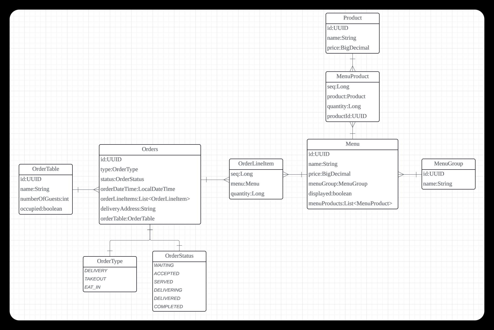

= 키친포스

== 퀵 스타트

[source,sh]
----
cd docker
docker compose -p kitchenpos up -d
----

== 요구 사항

* 음식점 포스기 시스템을 구현한다.
* 메뉴카테고리(그룹)
** 메뉴카테고리는 이름 정보을 가지고 있다.
** [ ] 사용자는 관리자이다.
** [ ] 관리자은 메뉴카테고리를 추가할 수 있다.
*** 조건 1) 이름을 반드시 입력해야 된다.
** [ ] 관리자은 등록한 모든 메뉴카테고리 리스트를 조회할 수 있다.
* 음식
** 음식은 이름, 가격을 가지고 있다.
** [ ] 사용자는 관리자이다.
** [ ] 관리자은 음식 이름과 가격을 정해서 음식을 등록할 수 있다.
*** 조건 1) 가격과 이름은 반드시 입력해야 된다.
*** 조건 2) 이름에 비속어가 포함되어 있음 안된다.
*** 조건 3) 가격은 음수일 수 없다.
** [ ] 관리자은 음식 가격을 변경할 수 있다.
*** 조건 1) 가격은 반드시 입력해야 되며 음수일 수 없다.
*** 가격을 변경할 음식이 속한 메뉴를 찾아 메뉴의 가격을 다시 산정해서 단일 음식의 총 금액보다 비싼 메뉴는 판매중단으로 노출 상태가 바뀐다.
** [ ] 관리자은 모든 음식 리스트를 조회할 수 있다.
* 메뉴
** 메뉴는이름, 가격, 메뉴카테고리, 노출여부(판매중, 판매중단), 음식들 정보을 가지고 있다.
** [ ] 사용자는 관리자이다.
** [ ] 관리자은 특정 메뉴 카테고리에 음식을 조합해서 메뉴를 등록할 수 있다.
*** 조건 1) 메뉴 가격은 반드시 있어야 되며 음수일 수 없다.
*** 조건 2) 미리 등록된 메뉴 카테고리와 음식들만 메뉴로 등록할 수 있으며 반드시 메뉴로 구성할 음식을 정하고 음식의 수량은 음수일 수 없다.
*** 조건 3) 조합된 음식의 가격이 단일 음식들의 총 금액보다 비쌀 수 없다.
*** 조건 4) 메뉴 이름에 비속어가 포함되어 있으면 안된다.
** [ ] 관리자은 등록한 메뉴의 가격을 변경할 수 있다.
*** 조건 1) 가격은 반드시 입력해야 되며 음수일 수 없다.
*** 조건 2) 조합된 음식의 가격이 단일 음식들의 총 금액보다 비쌀 수 없다.
** [ ] 관리자은 등록한 메뉴의 노출 상태를 변경할 수 있다.(상태 : 판매중, 판매중단)
*** 조건 1) 등록되어 있는 메뉴의 노출 상태만 변경할 수 있다.
*** 판매중으로 상태 변경할 경우 : 해당 메뉴 조합의 가격이 단일 음식들의 총 금액보다 비싸면 안된다.
* 주문 테이블
** 주문테이블은 이름, 주문테이블 배정 인원 수, 상태(사용중) 정보를 가지고 있다.
** [ ] 사용자는 관리자이다.
** [ ] 관리자은 주문테이블을 등록할 수 있다.
*** 조건 1) 이름을 반드시 입력해야 된다.
** [ ] 관리자은 손님이 들어오면 등록한 주문테이블에 손님 인원수를 변경할 수 있다.
*** 조건 1) 등록하려는 인원수는 음수일 수 없다.
*** 조건 2) 등록되어 있는 주문테이블을 입력해야 된다.
*** 조건 3) 입력한 주문 테이블의 상태가 이미 찼을 경우 인원수를 변경할 수 없다.
** [ ] 관리자은 손님이 해당 주문테이블에 앉은 경우 상태를 가득찬으로 바꾼다.
*** 조건 1) 등록되어 있는 주문테이블을 입력해야 된다.
** [ ] 관리자은 주문테이블을 다 치우면 상태를 다시 초기화한다.
*** 조건 1) 등록되어 있는 주문테이블을 입력해야 된다.
*** 조건 2) 주문테이블의 상태가 주문완료가 아니면 치울 수 없다.
* 주문
** 주문은 주문유형, 주문상태, 주문생성날짜, 주문한 음식들(메뉴 정보, 수량), 배달 주소, 주문 테이블 정보를 가지고 있다.
*** 주문 상태는 다음과 같다.
**** WAITING - 대기
**** ACCEPTED - 접수
**** SERVED - 서빙
**** DELIVERING - 배달
**** DELIVERED - 배달완료
**** COMPLETED - 주문완료
*** 주문 유형는 다음과 같다.
**** DELIVERY - 배달하기
**** TAKEOUT - 포장하기
**** EAT_IN - 먹고가기
** [ ] 사용자는 카운터이다.
** [ ] 카운터는 손님의 요청사항에 맞춰 메뉴를 선택해서 주문을 대기상태로 등록한다.(단, 판매중인 음식만 주문할 수 있음)
*** 조건 1) 주문 유형은 반드시 입력해야 된다.
*** 조건 2) 선택한 주문이 반드시 있어야 되며 주문한 메뉴들은 미리 등록되어 있어야 된다.
*** 조건 3) 선택한 메뉴들은 모두 판매중 상태여야 한다.
*** 조건 4) 입력한 주문 메뉴와 기존에 등록된 메뉴의 가격이 다르면 안된다.
** [ ] 카운터는 손님이 먹고가기를 선택한 경우 주문테이블에 주문을 등록해야 된다.
** [ ] 카운터는 손님이 포장하기/배달하기를 선택한 경우 음식 재고를 먼저 확인한 뒤 주문을 등록해야 된다.
*** 배달하기인 경우 배달할 장소에 대한 정보를 반드시 기재해야 된다.
** [ ] 주방에서 주문이 들어가면 주문 상태를 접수로 바꾼다.
*** 조건 1) 입력한 주문은 미리 등록되어 있어야 한다.
*** 배달인 경우 상태변경과 함께 라이더를 요청한다.
** [ ] 음식이 완료되면 상태를 서빙으로 바꾼다.
*** 조건 1) 입력한 주문은 미리 등록되어 있어야 한다.
*** 조건 2) 입력한 주문의 현재 상태는 접수여야 한다.
** [ ] 라이더가 픽업을 오면 주문을 배달중으로 바꾼다.
*** 조건 1) 입력한 주문은 유형은 반드시 배달하기여야 한다.
*** 조건 2) 입력한 주문의 상태는 서빙상태여야 한다.
** [ ] 라이더가 배달을 완료하면 상태를 배달 완료로 바꾼다.
*** 조건 1) 입력한 주문은 미리 등록되어 있어야 한다.
*** 조건 2) 입력한 주문의 상태는 배달중이여야 한다.
** [ ] 모든 단계가 끝나면 상태를 완료로 바꾼다.
*** 조건 1) 입력한 주문은 미리 등록되어 있어야 한다.
*** 조건 2) 주문 유형이 배달인 경우 현재 주문상태가 배달완료여야 한다. 그외 유형은 서빙 상태여야 한다.
*** 먹고가기인 경우 상태 변경 후 주문테이블 정보를 확인해서 한번더 초기화 해준다.
** [ ] 주문 상태는 각각의 단계에 맞게 변경되어야 한다. (이전 상태가 다를 경우 에러 발생)
*** 먹고가기 : 대기 &gt; 접수 &gt; 서빙 &gt; 완료
*** 포장하기 : 대기 &gt; 접수 &gt; 서빙 &gt; 완료
*** 배달하기 : 대기 &gt; 접수 &gt; 서빙 &gt; 배달중 &gt; 배달완료 &gt; 완료
** [ ] 카운터은 모든 주문 리스트를 조회할 수 있다.

== 용어 사전

|===
|한글명 |영문명 |설명 

| | | 
|===

== 모델링

== 엔티티 관계

