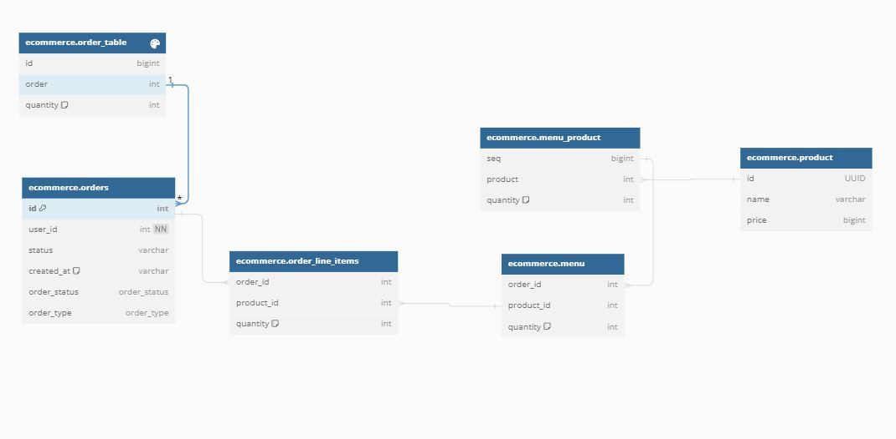

# 키친포스

## 퀵 스타트

```sh
cd docker
docker compose -p kitchenpos up -d
```
## DB 엔티티 다이어그램
- 엔티티 내부의 필드는 추후에 갱신하겠습니다.




## 요구 사항

- 키친포스라는 식당을 운영하는데 필요한 POS기를 구현한다.
- 메뉴 카테고리 
  - 액터  
    - 사장님
  - 상태
    - 메뉴 카테고리는 이름을 가진다. (ex: '추천메뉴', '신메뉴', '2명을 위한 메뉴')
  - 행동
    - 사장님이 메뉴 카테고리를 생성할 수 있다.
      - 생성 시 메뉴 카테고리의 이름은 비어있을 수 없다.
    - 사장님이 메뉴 카테고리들을 조회할 수 있다.

- 상품
    - 액터
      - 사장님
    - 상태
        - 상품은 음식 이름을 가진다. (ex: '프라이드 치킨', '옥수수튀김', '회전회오리 튀김')
        - 상품은 가격을 가진다.
    - 행동
        - 사장님이 음식을 생성할 수 있다.
            - 생성 시 메뉴 카테고리의 이름은 비어있을 수 있다.
            - 비속어는 포함 될 수 없다.
            - 가격은 양수이어야 한다.
        - 사장님이 상품들을 조회할 수 있다.
        - 사장님이 상품 가격을 변경할 수 있다.
          - 가격은 양수이어야 한다.
          - 메뉴에 속한 상품들의 가격의 총합이 메뉴의 가격보다 높으면 메뉴가 전시상태가 `미노출` 로 바뀐다.

- 메뉴
    - 액터
      - 사장님
    - 상태
      - 메뉴는 이름은 1글자 이상이어야한다 (ex: '프라이드 치킨2마리', '프라이드치킨 + 치즈볼', '불고기버거 세트')
      - 메뉴는 가격은 양수이어야한다.
      - 메뉴는 메뉴 카테고리를 가진다.
      - 메뉴는 전시상태를 가진다.
      - 메뉴는 상품들(1개 이상)을 가진다.
    - 행동
      - 사장님이 메뉴를 생성할 수 있다.
        - 메뉴는 메뉴 카테고리를 가져야한다. 
        - 메뉴는 상품 1개 이상으로 구성되어야 한다.
        - 메뉴에 등록된 상품의 개수는 1개 이상이어야 한다.
        - 메뉴에는 비속어가 들어갈 수 없다.
      - 사장님이 메뉴의 가격을 변경할 수 있다.
        - 메뉴가 메뉴에 속한 상품들의 가격의 총합보다 가격이 클 수 없다.
      - 사장님이 메뉴를 전시할 수 있다.
        - 메뉴가 메뉴에 속한 상품들의 가격의 총합보다 가격이 클 수 없다.
        - 메뉴가 존재하지 않으면 전시 할 수 없다.
      - 사장님이 메뉴를 숨길 수 있다.
        - 메뉴가 존재하지 않으면 숨길 수 없다.
      - 사장님이 메뉴를 조회 할 수 있다.

- 주문
    - 액터
      - 사장님
      - 라이더
    - 상태
      - 주문은 주문 상태를 가진다.
        - WAITING: 대기중 (주문 생성 시)
        - ACCEPTED: 접수 (주문 수락 시)
        - SERVED: 전달 (주문을 손님, 라이더에게 전달시)
        - DELIVERING: 배달중 (라이더에게 전달 완료)
        - DELIVERED: 배달완료 (라이더가 배달 완료)
        - COMPLETED: 주문완료 (주문완료 설정)
      - 주문은 주문한 메뉴들을 가진다.
      - 주문은 주문 종류를 가진다.
        - DELIVERY - 배달 (필수값: 주문 장소)
        - TAKEOUT - 포장 
        - EAT_IN 매장내 (필수값: 주문 테이블)
    - 행동
      - 사장님이 주문을 생성할 수 있다.
        - 주문은 메뉴 1개 이상으로 구성되어야 한다.
        - 주문 종류: 공통 (해당 조건은 공통으로 지켜져야 한다.)
          - 주문을 생성할 때, `대기중` 으로 주문 상태를 변경한다.
          - 메뉴 내의 주문상품들이 삭제된 상품이면 안된다.
          - 메뉴 내의 주문상품들이 삭제된 상품이면 안된다.
          - 메뉴가 생성된 상태이고 전시 되어있어야한다.
          - 메뉴의 가격 총합과 주문상품들의 가격 총합이 동일해야한다.
        - 주문 종류: 배달
          - 주문을 취소할 수 없다.
          - 주문 장소가 없다면 주문할 수 없다.
        - 주문 종류: 포장
          - 주문을 취소할 수 없다.
        - 주문 종류: 매장내
          - 주문 테이블이 없으면 주문 할 수 없다.
          - 주문 테이블이 있으면 테이블을 주문에 할당한다.
          - 주문을 취소할 수 있다.
      - 사장님이 주문을 접수한다.
        - 주문의 상태를 `접수`로 변경한다.
        - 주문 종류가 `배달`이면 라이더에게 주문에 대한 배달을 요청한다. (외부 서비스)
      - 사장님이 주문을 손님에게 전달한다.
        - 주문이 삭제되지 않아야 한다.
        - 주문의 상태가 `접수`이어야 한다.
      - 사장님이 주문을 라이더에게 전달한다.
        - 주문 종류가 `배달`이어야 한다.
        - 주문 상태가 `전달`인 내부 손님에게 전달된 주문은 전달할 수 없다.
      - 라이더가 주문을 배달완료 한다.
        - 주문이 삭제되지 않아야 한다.
        - 주문 상태가 `배달중`이어야 한다.
      - 사장님이 주문을 완료한다.
        - 주문 종류가 `매장내` 이거나 `포장` 일 경우에 주문 상태가 `전달`이 아니라면 주문 완료 할 수 없다.
        - 주문 종류가 `배달` 일 때, 주문 상태가 `배달완료` 된 주문만 완료 할 수 있다.
        - 주문 종류가 `매장내` 일 때, 주문 테이블의 상태를 초기화한다.
      - 사장님은 모든 주문리스트를 조회할 수 있다.

- 주문 테이블
  - 액터
    - 사장님
  - 상태
    - OCCUPIED: 사용중
  - 행동
    - 사장님이 주문 테이블을 등록한다.
      - 주문 테이블의 이름은 비어있을 수 없다.
    - 사장님이 주문 테이블에 손님을 등록한다.
      - 주문 테이블이 등록 되어있다면 상태를 `사용중`으로 변경한다.
    - 사장님이 주문 테이블의 손님의 수를 변경한다.
      - 주문 테이블의 변경하고자 하는 손님의 수가 음수라면 변경되지 않는다.
      - 주문 테이블이 등록되어 있지 않으면 변경되지 않는다.
    - 사장님이 주문 테이블의 상태를 사용가능하게 만든다.
      - 주문 테이블의 주문 상태가 `주문완료`이어야 한다.
      - 주문 테이블이 등록되어 있지 않으면 변경되지 않는다.
      - 주문 테이블의 상태가 `사용 중`이 아니라면 변경되지 않는다.
    - 사장님이 주문 테이블들을 조회할 수 있다.

## 용어 사전


| 한글명 | 영문명 | 설명 |
| --- | --- | --- |
|  |  |  |

## 모델링


