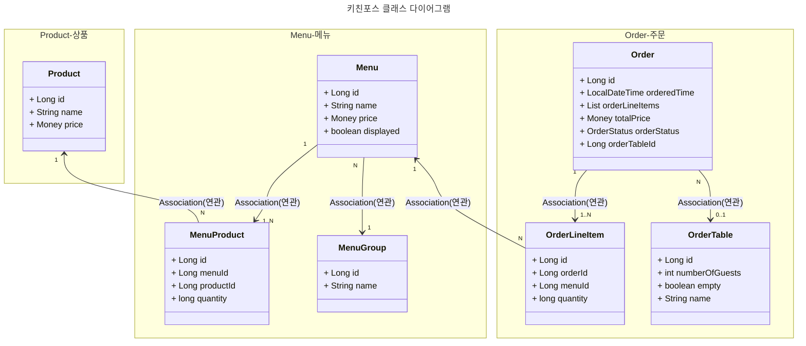
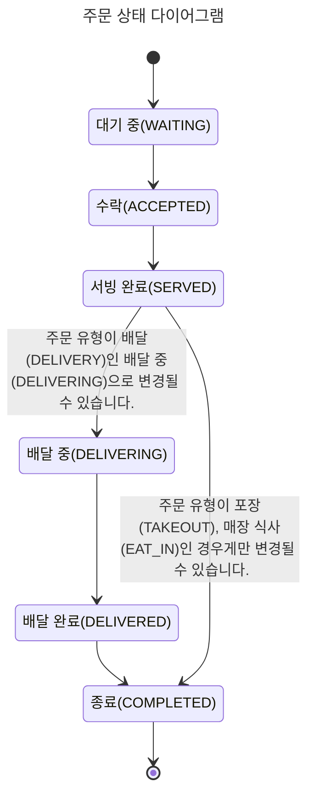

# 키친포스

## 도메인

### 요구 사항
- [ ] 고객에게 제공하는 메뉴와 이를 통해 발생한 주문을 관리할 수 있는 시스템을 구현한다
- [ ] 가격 (price)
  - [ ] 대상을 판매할 때 고객에게 요구하는 금액을 말한다.
  - [ ] 가격은 0원 이하일 수 없다.
- [ ] 개수 (quantity)
  - [ ] 판매되는 물건의 수를 의미합니다.
  - [ ] 개수는 0 이하 일 수 없다.
- [ ] 이름 (name)
  - [ ] 특정 대상을 가리키는 단어를 의미한다.
  - [ ] 이름은 공백을 제외하고 한 글자 이상 이어야 합니다.
  - [ ] 이름은 욕설과 비속어가 될 수 없다.
- [ ] 상품(product)
  - [ ] 상품은 상품의 이름과 가격를 가진다.
  - [ ] 가격은 0원 이하일 수 없다.
  - [ ] 이름은 공백을 제외하고 한 글자 이상 이어야 합니다.
  - [ ] 이름은 욕설과 비속어가 될 수 없다.
  - [ ] 상품의 가격을 수정될 수 있어야 한다.
    - [ ] 상품의 가격이 변경 되었을 때 해당 상품이 포함된 메뉴의 가격도 변경되어야 한다.
    - [ ] 상품의 가격이 변경 되었을 때 메뉴의 가격을 구하는 산식은 다음과 같다. `sum(메뉴를 구성하는 상품의 가격 * 갯수)`
- [ ] 메뉴(menu)
  - [ ] 메뉴는 메뉴의 이름과 가격(price), 그리고 메뉴를 구성하는 **메뉴 구성 상품(menu_product)**, 메뉴를 분류하는 **메뉴 그룹(menu_group)** 을 가진다.
  - [ ] 가격은 0원 이하일 수 없다.
  - [ ] 이름은 공백을 제외하고 한 글자 이상 이어야 합니다.
  - [ ] 이름은 욕설과 비속어가 될 수 없다.
  - [ ] 메뉴는 1개 이상의 **메뉴 구성 상품(menu_product)** 으로 구성된다.
  - [ ] 메뉴는 하나의 **메뉴 그룹(menu_group)** 에 속한다.
  - [ ] 메뉴는 노출 여부는 노출/미노출 중 하나로 변경될 수 있다.
    - [ ] 메뉴의 노출은 `sum(메뉴를 구성하는 상품의 가격 * 갯수)`이 1원 이상일 때만 가능하다.
  - [ ] 메뉴의 가격은 결정하는 산식은 `sum(메뉴를 구성하는 상품의 가격 * 갯수)` 이지만, 관리자가 원하는 1원 이상의 가격(price)으로 변경될 수 있다. 
  - [ ] 메뉴 구성 상품(menu_product)
    - [ ] 메뉴 구성 상품은 메뉴를 구성하는 상품과 하나 이상의 개수를 가진다.
    - [ ] 개수는 0 이하 일 수 없다.
  - [ ] 메뉴 그룹(menu_group)
    - [ ] 메뉴는 비슷한 특징을 가진 메뉴들 끼리 **메뉴 그룹**이란 단위로 묶일 수 있다.
    - [ ] 이름은 공백을 제외하고 한 글자 이상 이어야 합니다.
    - [ ] 이름은 욕설과 비속어가 될 수 없다.
- [ ] 주문(order)
  - [ ] 주문은 전시된 메뉴가 판매 되었을 때 발생한다.
  - [ ] 주문은 주문 유형(order_type), 주문 상태(order_status), 주문 일시, 배달 주소, 주문 품목(order_line_item), 주문 테이블(order_table) 등를 가집니다.
    - [ ] 주문 유형(order_type) 에는 매장 식사(EAT_IN), 포장(TAKE_OUT), 배달(DELIVERY)이 있다.
        - [ ] 주문 유형이 배달(DELIVERY)인 경우에 배달 주소는 필수로 입력되어야 한다.
        - [ ] 주문 유형이 매장 식사(EAT_IN)인 경우에 주문 테이블(order_table)이 지정되어야 한다.
    - [ ] 주문의 상태는 다음과 같으며, 상태의 라이프사이클은 [주문 상태 다이어그램](#### 주문 상태 다이어그램)을 참조한다.
      - [ ] 대기 중(WAITING): 고객에 의해 주문이 요청되었으나 접수되지 않은 상태를 말합니다.
      - [ ] 수락(ACCEPTED): 주문이 접수되어 조리가 시작된 상태를 말합니다.
      - [ ] 서빙 완료(SERVED): 주문된 메뉴가 모두 조리된 상태를 말합니다.
      - [ ] 배달 중(DELIVERING): 조리가 완료된 주문의 배달이 시작된 상태를 말합니다. 주문 유형이 배달(DELIVERY)인 배달 중(DELIVERING)으로 변경될 수 있습니다
      - [ ] 배달 완료(DELIVERED): 배달이 완료된 상태를 말합니다. 주문 유형이 배달(DELIVERY)인 배달 완료(DELIVERED)으로 변경될 수 있습니다
      - [ ] 종료(COMPLETED): 종료는 주문 유형 별로 다음과 같이 정의됩니다.
        - [ ] 매장 식사(EAT_IN): 고객의 식사가 끝나고 테이블이 정리되어 모든 거래가 완전히 끝난 상태를 말합니다.
        - [ ] 포장(TAKE_OUT): 고객에게 음식이 전달된 이후에 모든 거래가 완전히 끝난 상태를 말합니다.
        - [ ] 배달(DELIVERY): 고객에게 음식이 배달된 이후에 모든 거래가 완전히 끝난 상태를 말합니다.
    - [ ] 주문이 만들어 질 때 아래 내용이 준수되어야 한다.
      - [ ] 주문은 하나의 주문 유형에는 반드시 속해야 합니다.
      - [ ] 주문은 하나 이상의 주문 품목이 반드시 있어야 하며, 주문 품목에 해당하는 메뉴가 전시 상태의 0원 이상이어야 합니다.
      - [ ] 주문은 최초에 대기 상태입니다.
      - [ ] 매장 식사(EAT_IN)인 경우에 주문품목의 개수가 0개 이하일 수 없습니다.
      - [ ] 주문 유형이 배달(DELIVERY)인 경우에 배달 주소는 필수로 입력되어야 한다.
      - [ ] 주문 유형이 매장 식사(EAT_IN)인 경우에 주문 테이블(order_table)이 지정되어야 한다.
    - [ ] 주문이 수락 될 때 아래 내용이 준수되어야 한다.
      - [ ] 주문은 대기 중(WAITING) 상태에서만 수락(ACCEPTED) 상태로 변경될 수 있다.
      - [ ] 주문이 배달인 경우에 키친라이더에게 배달 요청이 된다.
    - [ ] 주문이 서빙완료 될 때 아래 내용이 준수되어야 한다.
      - [ ] 주문은 수락(ACCEPTED) 상태에서만 서빙 완료(SERVED) 상태로 변경될 수 있다.
    - [ ] 주문이 배달 중(DELIVERING) 상태로 변경될 때 아래 내용이 준수되어야 한다.
      - [ ] 주문은 서빙 완료(SERVED) 상태에서만 배달 중(DELIVERING) 상태로 변경될 수 있다.
      - [ ] 주문 유형이 배달이어야 한다.
    - [ ] 주문이 배달 완료(DELIVERED) 상태로 변경될 때 아래 내용이 준수되어야 한다.
      - [ ] 주문은 배달 중(DELIVERING) 상태에서만 배달 완료(DELIVERED) 상태로 변경될 수 있다.
      - [ ] 주문 유형이 배달이어야 한다.
    - [ ] 주문이 종료(COMPLETED) 상태로 변경될 때 아래 내용이 준수되어야 한다.
      - [ ] 주문 유형이 배달(DELIVERY) 이 아닌 경우에는 서빙 완료(SERVED) 상태에서만 종료(COMPLETED) 상태로 변경될 수 있다.
      - [ ] 주문 유형이 배달(DELIVERY) 인 경우에는 배달 완료(DELIVERED) 상태에서만 종료(COMPLETED) 상태로 변경될 수 있다.
      - [ ] 주문 유형이 매장 식사(EAT_IN)인 경우 이 종료(COMPLETED) 상태로 변경될 때 주문 테이블(order_table)를 정리(clear) 한다.
      - [ ] 주문 유형이 매장 식사(EAT_IN)이어야 한다.
  - [ ] 주문 품목(order_line_item)
    - [ ] 주문 품목은 특정 주문에 대해 주문된 한 개 혹은 여러 개의 메뉴와 각 메뉴의 개수를 말합니다.
    - [ ] 개수는 0 이하 일 수 없다.
    - [ ] 해당 메뉴가 전시 중일 때만 주문 될 수 있습니다.
  - [ ] 주문 테이블(order_table)
    - [ ] 주문 테이블은 점유 여부, 테이블의 이름 그리고 해당 테이블을 이용 중인 고객의 수를 가진다.
      - [ ] 주문 테이블은 테이블의 이름은 공백을 제외한 한 글자 이상이어야 합니다.
      - [ ] 주문 테이블은 점유 여부에 따라 점유/비정유 상태를 가집니다.
        - [ ] 점유 중일 때는 점유 여부가 true가 되며, 추가적으로 고객의 수를 한 개 이상으로 설정할 수 있습니다.
          - [ ] 점유 중으로 변경할 때의 **명령**을 착석(sit) 이라 합니다.
          - [ ] 점유 중일 떄만 이용 중인고객의 수를 변경할 수 있습니다.
        - [ ] 비 점유 상태일 때는 점유 여부가 false가 되며, 고객의 수가 0으로 설정 됩니다.
          - [ ] 비 점유 상태로 변경 할 때에 **명령**을 정리(clear) 라 합니다.
#### 요구사항 분석 중 이상한 점
- 주문이 매장 식사(EAT_IN)일 때만 주문품목이 0개 이하일 수 없다는게 좀 이상하다.
### 용어 사전
| 한글명             | 영문명             | 설명                                                     |
|-----------------|-----------------|--------------------------------------------------------|
| 상품              | product         | 키친포스에서 판매되는 물건입니다.                                     |
| 가격              | price           | 물건을 판매할 때 고객에게 요구하는 금액을 말합니다.                          |
| 개수              | quantity        | 하나씩 셀 수 있는 물건의 수.                                      |
| 이름              | name            | 특정 대상을 가리키는 단어                                         |
| 비속어             | profanity       | 사회에서 모욕, 비하하는 말을 의미 합니다.                               |
| 메뉴              | menu            | 고객에게 전시되어 판매되는 상품 입니다.                                 |
| 메뉴 구성 상품        | menu_product    | 메뉴를 구성하는 상품 입니다.                                       |
| 메뉴 그룹           | menu_group      | 유사한 특징을 가져서 동일하게 분류될 수 있는 메뉴를 묶어주는 것을 의미합니다.           |
| 주문              | order           | 주문은 전시된 메뉴가 판매 되었을 때 발생한다.                             |
| 주문 유형           | order_type      | 주문이 매장 식사(EAT_IN), 포장(TAKE_OUT), 배달(DELIVERY)를 구분하는 값. |
| 주문 상태           | order_status    | 주문이 현재 진행 상태를 나타내는 값 입니다.                              |
| 주문 품목           | order_line_item | 특정 주문에 대해 주문된 한 개 혹은 여러 개의 메뉴와 각 메뉴의 개수를 말합니다.         |
| 주문 테이블          | order_table     | 주문이 발생한 테이블을 의미합니다.                                    |
| 주문 테이블 착석 or 착석 | sit             | 특정 테이블 점유 상태가 되었으며 이용 중인 고객이 있음을 의미합니다.                |
| 주문 테이블 정리 or 정리 | clear           | 특정 테이블이 점유 해제 되었으며 이용 중인 고객이 없음을 의미합니다.                |


### 모델링
#### 키친포스 클래스 다이어그램


#### 주문 상태 다이어그램



## 인프라

### 퀵 스타트

```sh
cd docker
docker compose -p kitchenpos up -d
```