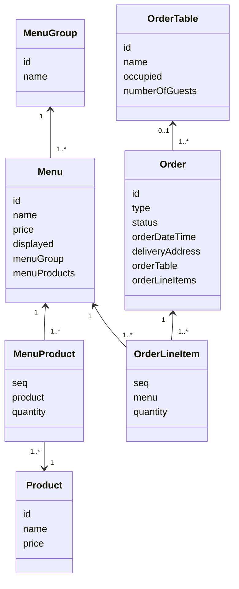
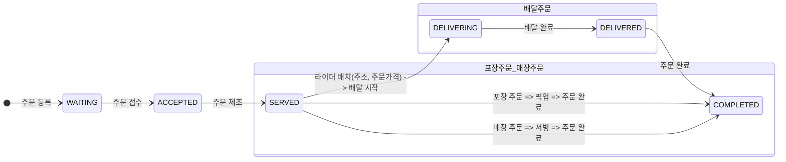

# 키친포스

## 퀵 스타트

```sh
cd docker
docker compose -p kitchenpos up -d
```

## 요구 사항
> 키친 포스 시스템을 구현한다.


## 용어 사전

| 한글명 | 영문명 | 설명 |
| --- | --- | --- |
|  |  |  |

## 모델링

### 클래스 관계도램


#### 주문 상태 프로세스



-----------------------------------------------------------------------------------------------------
---
# 도메인 주도 설계 이해

## 1단계 - 문자열 덧셈 계산기

### 요구 사항

- 컴마(,) 또는 콜론(:)을 구분자로 가지는 문자열을 전달하는 경우 구분자를 기준으로 분리한 각 숫자의 합을 반환 (예: “” => 0, "1,2" => 3, "1,2,3" => 6, “1,2:3” => 6)
- 앞의 기본 구분자(쉼표, 콜론) 외에 커스텀 구분자를 지정할 수 있다. 커스텀 구분자는 문자열 앞부분의 “//”와 “\n” 사이에 위치하는 문자를 커스텀 구분자로 사용한다.<br>
  예를 들어 “//;\n1;2;3”과 같이 값을 입력할 경우 커스텀 구분자는 세미콜론(;)이며, 결과 값은 6이 반환되어야 한다.
- 문자열 계산기에 숫자 이외의 값 또는 음수를 전달하는 경우 `RuntimeException` 예외를 throw 한다.

### 기능 목록
- [x] 유효한 문자열에 대해 음수가 아닌 숫자로 반환하는 기능
  - [x] 문자열을 입력받아 음수나 숫자가 아닌 문자를 입력받으면 예외 발생
  - [x] 정적 팩토리 메서드 사용하여 Number 생성.
  - [x] `empty`이나 `null`에 대해 0 반환 (더하여 blank 처리도...)
  - [x] 숫자일 경우 숫자 한개만 반환
  - [x] 덧셈 기능 추가
- [x] 요구사항에 따른 구분자 관련된 기능
  - [x] 컴마와 콜론에 대한 처리
  - [x] custom 구분자에 대한 처리
- [x] 합을 반환하는 기능
  - [x] 숫자가 두개 이상일 경우를 생각해서 숫자 리스트를 일급 객체로 반환

### 리뷰사항 반영 목록
- [x] 예외 상세메세지에 실패 관련 정보도 담기
- [x] 테스트 코드에서의 과도한 구현 제거
- [x] DisplayName 다듬기와 테스트 코드에 디스플레이 네임 작성 이유와 역할 생각해보기
  - 가독성 향상 : 테스트 케이스를 읽는 사람이 해당 테스트 케이스가 어떤 동작을 수행하는지 쉽게 이해하기 위해 사용
  - 유지보수성 향상 : 테스트 코드의 의도를 더 쉽게 파악할 수 있어 테스트 코드 수정시 어떤 부분을 수정해야하는지 더 빠르게 파악 가능
  - 테스트 결과 이해 : 테스트 케이스의 결과를 파악하는것이 더 쉬워짐.
- [x] NumbersParserUtils의 생성자에서 exception 을 던져서 내부에서도 생성을 못하도록 막아ㅇ주기
- [x] 테스트 코드가 작성되지 않은 클래스 테스트 코드 작성하기
  - [x] 전략패턴 관련한 테스트
  - [x] NumberParserUtils 테스트

---

## [🚀 2단계 - 요구 사항 정리]

### 요구 사항
- `kitchenpos` 패키지의 코드를 보고 키친포스의 요구 사항을 `README.md`에 작성한다.

### 요구사항 흐름 정리
> 아래의 순서대로 해당 미션의 요구사항을 정리한다.

1. [x] 도메인 요구사항의 목표를 작성한다.
1. 코드 분석한 내용을 작성한다.
  - [ ] `kitchenpos` 패키지의 코드를 보고 추론해본다.
    - [x] Product
    - [x] Menu
    - [x] MenuGroup
    - [x] Order
    - [x] OrderTable
    - [x] 매핑 테이블 정리
    - [x] 분생각해 볼 추가 요구사항 분석
    > - Table 의 구조를 파악한다.
    > - http 디렉터리의 .http 파일(HTTP client)을 보고 어떤 요청을 받는지 참고한다.
    > - 각 요청의 흐름 순서대로 분석해보자.
    > - 개발적인 요소들이 포함되도 좋으니 일단 작성해보자.
1. 작성된 초안을 참고하여 요구사항을 작성한다.
  - [x] 필요한 도메인 모델링 작성
  - [ ] 유비쿼터스 언어를 아래 `용어사전`에 정의한다.
  - [ ] 사용자가 사용하는 진입 경로 순서로 요구사항을 목록화 한다.
1. 요구사항을 리팩토링 한다.
  - [ ] 작성한 요구사항이 모두가 합의할 수 있는 내용인지 확인한다.
  - [ ] 도메인 전문가나 도메인 이해관계자가 이해할 수 있는 언어로 작성되어있는지 확인한다.
  - [ ] 오탈자나 어색한 문맥이 있는지 확인한다.

### 코드 분석

#### `상품(Product)`
- 상품은 이름(name)과 가격(price)을 관리한다.
- `create` : 상품을 등록할 수 있다.
  - 상품의 이름과 가격은 필수로 입력해야 한다.
  - 상품의 이름에는 비속어가 포함될 수 없다.
  - 상품의 가격은 0 이상이다.
- `changePrice` : 상품의 가격을 수정할 수 있다.
  - 해당 상품의 가격은 필수로 입력한다.
  - 상품의 가격은 0원 이상이다.
  - 해당 상품을 포함하는 **메뉴**들의 가격은 메뉴 가격 정책에 따른다.
    - 메뉴 가격 = (상품1의 가격 * 상품1의 개수) + (상품2의 가격 * 상품2의 개수) + ...
  - 만약 **원래 메뉴의 가격**이 **해당 상품이 속한 메뉴의 가격**보다 크다면, 해당 메뉴는 보이지 않도록 한다.
- `findAll` : 상품 목록을 조회할 수 있다.

#### `메뉴(Menu)`
- 메뉴는 이름(name), 가격(price), 메뉴표시 여부(displayed), 메뉴그룹(menuGroup), 메뉴구성상품(menuProducts)을 관리한다.
- 메뉴에서 **메뉴그룹**을 필수로 지정해야 한다.
  - 메뉴그룹은 이름(name)을 관리한다.
- 메뉴는 **메뉴 구성 상품**을 1개 이상을 가진다.
  - 메뉴 구성 상품은 **상품**과 상품의 개수를 관리한다.
- `create` : 메뉴를 등록할 수 있다.
  - 이름, 가격, 메뉴 그룹, 메뉴표시여부, 메뉴 구성 상품을 필수로 입력해야 한다.
  - 메뉴 이름은 필수로 입력하고, 비속어를 포함하지 않는다.
  - 메뉴 가격은 필수로 입력하고, 0원 이상이다.
  - 이미 등록된 메뉴그룹을 필수로 한 개 지정해야 한다.
  - 메뉴 구성 상품 종류의 가짓수는 1개 이상이다.
    - 미리 등록된 **상품**만 등록 할 수 있다.
    - 상품의 같은 종류를 2개 이상 담고 싶으면 상품의 개수로 관리한다.
    - 상품의 개수는 0개 이상이다.
    - **등록할 메뉴의 가격**이 **메뉴 구성 상품들의 총 가격**보다 클 수 없다.
      - => 단일 상품들 각각 사는 것 보다 메뉴의 가격이 비싸지 않다.
      - 메뉴 구성 상품들의 총 가격 = (상품1의 가격 * 상품1의 개수) + (상품2의 가격 * 상품2의 개수) + ...
- `changePrice` : 메뉴는 가격을 수정할 수 있다.
  - 가격은 필수 값이고 0 이상이다.
  - **수정한 메뉴 가격**이 **메뉴 구성 상품들의 총 가격**보다 같거나 저렴해야 한다.
- `display` : 메뉴를 목록에서 보이게 할 수 있다.
  - **메뉴 가격**이 **메뉴 구성 상품들의 총 가격**보다 같거나 저렴하면, 메뉴를 보여준다.
- `hide` : 메뉴를 목록에서 안 보이게 할 수 있다.
- `findAll` : 메뉴 목록을 조회할 수 있다.

#### `메뉴 그룹(MenuGroup)`
- 메뉴 그룹은 이름(name)을 관리한다.
- `create` : 메뉴 그룹을 등록할 수 있다.
  - 이름은 필수 값이다.
- `findAll` : 메뉴 그룹은 목록을 조회할 수 있다.

#### `주문(Order)`
- 주문은 주문종류(type), 주문상태(status), 주문시간(orderDateTime), 주문 메뉴 목록(orderLineItems), 배달 주소(deliveryAddress), 주문테이블(orderTable)을 관리한다.
  - 주문종류 : 배달, 포장, 매장
  - 주문상태 : 대기, 수락, 처리중, 배달중, 배달완료, 완료
  - 주문시간은 연도, 월, 일, 시, 분, 초를 관리한다.
  - **주문 메뉴**는 1개 이상이어야 한다.
    - 주문 메뉴는 **메뉴(menu)**, 수량(quantity), 가격(price)를 관리한다.
    - 메뉴, 수량은 필수 값이다.
  - **주문 테이블**
    - 이름(name), 인원(numberOfGuests), 테이블 상태(occupied)를 관리한다.
    - 모두 필수 값이다.
- `create` : 주문을 한다.
  - 주문종류, 주문상세, 주문시간, 주문 메뉴 목록은 필수로 입력해야 한다.
    - 주문 메뉴는 1개 이상이어야 한다.
      - 메뉴 목록에 있는 등록된 메뉴만 주문할 수 있다.
      - 같은 종류의 메뉴는 목록에 1개만 목록에 나타난다.
      - 원래 메뉴 가격과 주문할 때 가격이 같아야 한다.
    - 주문종류
      - 배달주문과 포장주문은 메뉴를 1개 이상 주문해야 한다.
      - 배달주문 시 주소가 있어야 한다.
      - 매장주문 시 테이블에 앉아 있어야 한다. (미리 주문 테이블이 API가 선행되어야 함.)
    - 주문상태는 대기상태이다.
- `accept` : 주문을 수락한다.
  - 주문이 대기상태에서 수락 상태가 된다.
  - 주문종류
    - 배달주문 시 배달 라이더(외부 연동 서비스)에게 배달 요청을 한다.
    - 라이더 매칭 시 주문 메뉴의 총 가격과 고객 주소를 보내준다.
- `serve` : 주문을 처리한다. (주문서가 주방에 제공되었다.)
  - 주문상태가 수락 상태에서 주문 처리 중으로 된다.
- `startDelivery` : 주문 배달을 시작한다.
  - 배달주문일 때, 주문상태가 처리 중인 상태에서 배달 중으로 된다.
- `completeDelivery` : 주문 배달을 완 한다.
  - 주문상태가 배달 중에서 배달 완료로 된다.
- `complete` : 주문이 완료된다.
  - 배달 주문일 때에는 배달완료에서 완료상태로 된다.
  - 포장 주문이나 매장 주문일 때에는 처리 중에서 완료 상태로 된다.
  - 매장 주문이 완료되면 해당 주문 테이블은 비웁니다.
- `findAll` : 주문 목록을 조회할 수 있다.

#### 주문 테이블(`OrderTable`)
- 주문테이블은 이름(name), 인원(numberOfGuests), 사용 여부(occupied)를 관리한다.
- `create` : 주문 테이블을 등록한다.
  - 테이블의 이름을 정하고, 해당 테이블은 비어있다.
- `sit` : 테이블에 사람들이 앉는다.
- `clear` : 테이블을 비운다.
  - 모든 주문이 완료된 상태이면 테이블을 비운다.
- `changeNumberOfGuests` : 테이블의 손님의 수를 변경한다.
  - 손님의 수는 필수 값이고, 0보다 커야 한다.
  - 사용 중인 해당 테이블은 손님의 수를 수정할 수 있다.
- `findAll` : 주문 테이블 목록을 조회할 수 있다.

#### 매핑테이블 정리
- 주문메뉴 항목(`OrderLineItem`) => 메뉴이다
  - 주문 메뉴는 **메뉴(menu)**, 수량(quantity), 가격(price)를 관리한다.
  - 주문 하나당 중복되지 않은 메뉴 종류가 1개 이상이다.
  - 메뉴의 가격 = 주문메뉴 항목의 가격
  - 한 주문의 가격 = sum(주문메뉴 항목)
- 메뉴구성 상품(`MenuProduct`) => 상품이다
  - 메뉴 구성 상품은 상품(Product)과 상품의 수량(quantity)을 관리한다.
  - 메뉴를 구성하는 상품은 하나의 메뉴에 여러가지 상품이 올 수 있다.
  - 하나의 구성 상품 총 가격 = (상품의 가격 * 수량)
  - 메뉴가격 <= sum(각 상품의 (상품의 가격 * 수량))

#### 생각해 볼 추가 요구사항 분석
- 클래스 관계 생각해보기
- 도메인 별 역할 생각해보기
- 주문 종류 별 주문상태에 관련된 다이어그램 생각해보기
- Validation 생각하기
