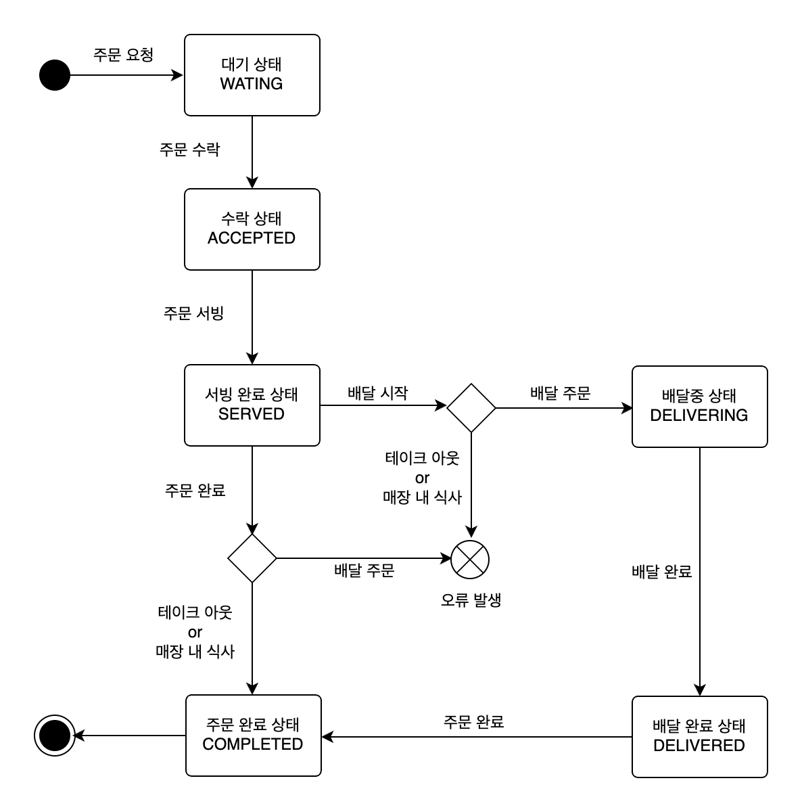

# 키친포스

## 퀵 스타트

```sh
cd docker
docker compose -p kitchenpos up -d
```

---

## 요구 사항

> 식당의 메뉴와 주문을 관리 할 수 있는 POS 시스템을 구현한다.

### 상품 (Product)

#### Create

- [ ] `상품(Product)`을 등록 할 수 있다.
    - [ ] `상품(Product)` 가격은 0원 이상이다.
    - [ ] `상품(Product)` 이름은 비어 있을 수 없고, 비속어를 포함 할 수 없다.

#### Update

- [ ] `상품(Product)` 가격을 변경 할 수 있다.
    - [ ] `상품(Product)` 가격은 0원 이상이다.
    - [ ] `상품(Product)` 가격 변경으로 인해, 해당 `상품(Product)`을 `메뉴 상품(MenuProduct)`으로 갖는 `메뉴(Menu)`의 가격이 `메뉴 상품(MenuProduct)`
      가격의 총합보다 커지는 경우, `메뉴(Menu)`를 감춘다.

#### Read

- [ ] `상품(Product)` 목록을 조회 할 수 있다.

<br />

### 메뉴 그룹 (MenuGroup)

#### Create

- [ ] `메뉴 그룹(MenuGroup)`을 등록 할 수 있다.
    - [ ] `메뉴 그룹(MenuGroup)` 이름은 비어 있을 수 없다.

#### Read

- [ ] `메뉴 그룹(MenuGroup)` 목록을 조회할 수 있다.

<br />

### 메뉴 (Menu)

#### Create

- [ ] `메뉴(Menu)`를 등록 할 수 있다.
    - [ ] `메뉴(Menu)` 가격은 0원 이상이다.
    - [ ] `메뉴(Menu)`는 반드시 하나의 `메뉴 그룹(MenuGroup)`에 속한다.
    - [ ] `메뉴(Menu)`는 반드시 하나 이상의 `메뉴 상품(MenuProduct)`을 갖는다.
        - [ ] `메뉴 상품(MenuProduct)` 수량은 0 이상이다.
        - [ ] `메뉴(Menu)` 가격은 `메뉴 상품(MenuProduct)` 가격의 총합보다 클 수 없다.
    - [ ] `메뉴(Menu)` 이름은 비어 있을 수 없고, 비속어를 포함 할 수 없다.

#### Update

- [ ] `메뉴(Menu)` 가격을 변경 할 수 있다.
    - [ ] `메뉴(Menu)` 가격은 0원 이상이다.
    - [ ] `메뉴(Menu)` 가격은 `메뉴 상품(MenuProduct)` 가격의 총합보다 클 수 없다.
- [ ] `메뉴(Menu)`를 노출 시킬 수 있다.
    - [ ] `메뉴(Menu)` 가격이 `메뉴 상품(MenuProduct)` 가격의 총합보다 큰 경우, `메뉴(Menu)`를 노출 시킬 수 없다.
- [ ] `메뉴(Menu)`를 감출 수 있다.

#### Read

- [ ] `메뉴(Menu)` 목록을 조회 할 수 있다.

<br />

### 주문 테이블 (OrderTable)

#### Create

- [ ] `주문 테이블(OrderTable)`을 등록 할 수 있다.
    - [ ] `주문 테이블(OrderTable)` 이름은 비어 있을 수 없다.
    - [ ] `주문 테이블(OrderTable)` 초기 등록 시, 손님 수는 0명이다.
    - [ ] `주문 테이블(OrderTable)` 초기 등록 시, 비어있는 상태이다.

#### Update

- [ ] `주문 테이블(OrderTable)`에 손님이 착석 할 수 있다.
- [ ] `주문 테이블(OrderTable)`을 빈 테이블로 세팅 할 수 있다.
    - [ ] `주문 테이블(OrderTable)`을 빈 테이블로 세팅 시, `주문 테이블(OrderTable)`의 `주문 상태(OrderStatus)`는 `완료 상태(OrderStatus.COMPLETED)`
      이어야 한다.
    - [ ] `주문 테이블(OrderTable)`을 빈 테이블로 세팅 시, 손님 수는 0 으로 세팅된다.
- [ ] `주문 테이블(OrderTable)`의 손님 수를 변경 할 수 있다.
    - [ ] `주문 테이블(OrderTable)`의 손님 수는 0명 이상이다.
    - [ ] 착석 중인 `주문 테이블(OrderTable)`만 손님 수를 변경 할 수 있다.

#### Read

- [ ] `주문 테이블(OrderTable)` 목록을 조회 할 수 있다.

<br />

### 주문 (Order)

#### Create

- [ ] `주문(Order)`을 등록 할 수 있다.
    - [ ] `주문(Order)`은 반드시 하나의 `주문 타입(OrderType)`을 갖는다.
        - [ ] `주문 타입(OrderType)`은 `매장 내 식사(OrderType.EAT_IN)`, `배달 타입(OrderType.DELIVERY)`
          또는 `테이크 아웃(OrderType.TAKEOUT)` 이다.
    - [ ] `주문(Order)`은 반드시 하나 이상의 `주문 아이템(OrderLineItem)`을 갖는다.
        - [ ] `주문 아이템(OrderLineItem)`은 주문할 `메뉴(Menu)`를 갖는다.
            - [ ] `주문 아이템(OrderLineItem)`은 노출되지 않은 `메뉴(Menu)`를 가질 수 없다.
        - [ ] `주문 아이템(OrderLineItem)`은 주문 수량을 갖는다.
            - [ ] `주문 타입(OrderType)`이 `매장 내 식사(OrderType.EAT_IN)`가 아닌 경우, 주문 수량은 0 이상이다.
        - [ ] 주문 시점의 `메뉴(Menu)` 가격이 현재 등록된 가격과 다른 경우, `주문(Order)`을 등록 할 수 없다.
    - [ ] `주문(Order)`은 반드시 하나의 `주문 상태(OrderStatus)`를 갖는다.
        - [ ] `주문(Order)`은 초기 생성 시, `대기 상태(OrderStatus.WAITING)`이다.
    - [ ] `주문(Order)`의 주문 시각은 `주문(Order)`이 등록되는 시각이다.
    - [ ] `주문(Order)`은 `주문 타입(OrderType)`이 `배달 타입(OrderType.DELIVERY)`인 경우, 반드시 배달 주소를 갖는다.
    - [ ] `주문(Order)`은 `주문 타입(OrderType)`이 `매장 내 식사(OrderType.EAT_IN)`인 경우, 반드시 `주문 테이블(OrderTable)` 을 갖는다.
        - [ ] `주문(Order)` 생성 시 `주문 테이블(OrderTable)`은 빈 테이블이어야 한다.

#### Update

- [ ] `주문(Order)`을 수락할 수 있다.
    - [ ] `주문(Order)` 수락 시, `주문(Order)`은 `대기 상태(OrderStatus.WATING)`이어야 한다.
    - [ ] `주문(Order)` 수락 시, `주문(Order)`은 `수락 상태(OrderStatus.ACCEPTED)`가 된다.
    - [ ] `주문 타입(OrderType)`이 `배달 타입(OrderType.DELIVERY)`인 경우, `배달 클라이언트(KitchenridersClient)`에게 배달을 요청한다.
- [ ] `주문(Order)`을 서빙할 수 있다.
    - [ ] `주문(Order)` 서빙 시, `주문(Order)`은 `수락 상태(OrderStatus.ACCEPTED)`이어야 한다.
    - [ ] `주문(Order)` 서빙 시, `주문(Order)`은 `서빙 완료 상태(OrderStatus.SERVED)`가 된다.
- [ ] `주문(Order)`을 배달 시작할 수 있다.
    - [ ] `주문 타입(OrderType)`이 `배달 타입(OrderType.DELIVERY)`이 아닌 경우, 배달을 시작할 수 없다.
    - [ ] `주문(Order)` 배달 시작 시, `주문(Order)`은 `서빙 완료 상태(OrderStatus.SERVED)`이어야 한다.
    - [ ] `주문(Order)` 배달 시작 시, `주문(Order)`은 `배달중 상태(OrderStatus.DELIVERING)`가 된다.
- [ ] `주문(Order)`을 배달 완료할 수 있다.
    - [ ] `주문(Order)` 배달 완료 시, `주문(Order)`은 `배달중 상태(OrderStatus.DELIVERING)`이어야 한다.
    - [ ] `주문(Order)` 배달 완료 시, `주문(Order)`은 `배달 완료 상태(OrderStatus.DELIVERED)`가 된다.
- [ ] `주문(Order)`을 완료할 수 있다.
    - [ ] `주문 타입(OrderType)`이 `배달 타입(OrderType.DELIVERY)`인 경우, `주문 상태(OrderStatus)`는 `배달 완료 상태(OrderStatus.DELIVERED)`
      이어야 한다.
    - [ ] `주문 타입(OrderType)`이 `테이크 아웃(OrderType.TAKEOUT)`이거나 `매장 내 식사(OrderType.EAT_IN)`인 경우, `주문 상태(OrderStatus)`
      는 `서빙 완료 상태(OrderStatus.SERVED)`이어야 한다.
    - [ ] 주문 완료 시, `주문(Order)`은 `완료 상태(OrderStatus.COMPLETED)`가 된다.
    - [ ] `주문 타입(OrderType)`이 `매장 내 식사(OrderType.EAT_IN)`인 경우, 해당 `주문 테이블(OrderTable)`을 빈 테이블로 세팅한다.
        - [ ] `주문 테이블(OrderTable)`의 손님 수를 0명으로 변경한다.

#### Read

- [ ] `주문(Order)` 목록을 조회할 수 있다.

<br />

###### Order State Diagram



---

## 용어 사전

| 한글명 | 영문명 | 설명 |
| --- | --- | --- |
|  |  |  |

## 모델링
