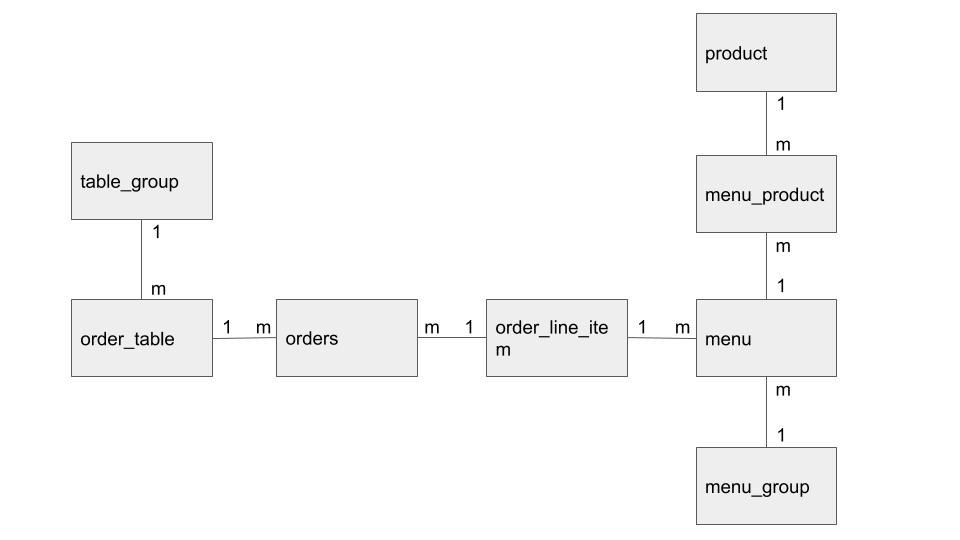

# 키친포스

## 요구 사항

치킨집의 포스기계에서 사용하는 어플리케이션을 구현한다.

### 메뉴(Menus)

- [ ] 메뉴가 제공되는 형태를 메뉴그룹이라고 부른다.
- [ ] 메뉴그룹을 설정할 수 있다.
- [ ] 메뉴그룹 목록을 볼 수 있다.
- [ ] 고객에게 제공되는 음식을 메뉴라고 부른다.
- [ ] 각 메뉴는 반드시 하나 이상의 메뉴그룹에 속한다.
- [ ] 메뉴를 만들 수 있는 상품의 재고를 볼 수 있다.
- [ ] 각 메뉴에 이름,가격을 설정할 수 있다.
- [ ] 각 메뉴의 이름을 설정할 수 있다.
- [ ] 메뉴 목록을 볼 수 있다.

### 주문(Orders)

- [ ] 테이블에 서빙되는 메뉴의 집합을 주문이라고 부른다.
- [ ] 주문은 상태를 가진다. (고객이 식사중인 주문: MEAL, 결재가 끝난 주문: COMPLETE)
- [ ] 주문 목록을 볼 수 있다.

### 상품(Products)

- [ ] 치킨집에서 제공할 수 있는 음식의 종류이다.
- [ ] 상품을 여러개 조합해서 메뉴로 만들 수 있다.
- [ ] 상품별 가격을 정할 수 있다.
- [ ] 상품 목록을 볼 수 있다.

### 테이블(Tables)

- [ ] 고객이 식사를 하는 자리를 테이블이라고 부른다.
- [ ] 특정 테이블에 몇 명의 고객이 있는지 볼 수 있다.
- [ ] 특정 테이블에 고객이 식사를 마치고 비었는지 설정할 수 있다.
- [ ] 테이블 목록을 볼 수 있다.
- [ ] 한 개 이상의 테이블이 붙어 있는 것을 테이블그룹이라고 부른다.
- [ ] 테이블을 떨어뜨려 놓으면 해당 테이블이 속한 테이블그룹을 지워야 한다.

## 용어 사전

| 한글명 | 영문명 | 설명 |
| --- | --- | --- |
|  |  |  |

## 모델링

## 기타

