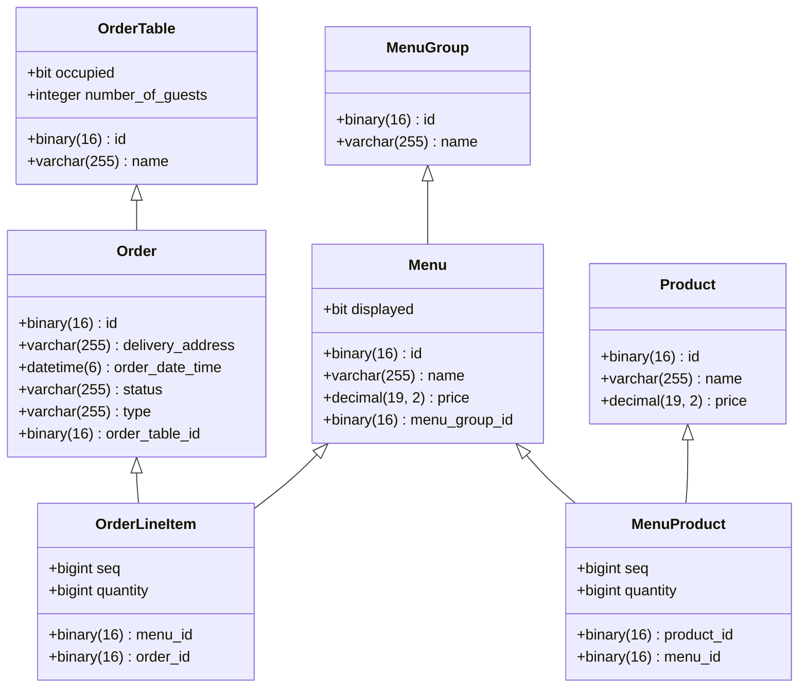

# 키친포스

## 퀵 스타트

```sh
cd docker
docker compose -p kitchenpos up -d
```

## 요구 사항

- 공통
    - UUID와 자동 증감값을 사용한다.
- 메뉴 그룹 (menu_group)
    - [ ] 메뉴 그룹은 UUID로 식별한다.
    - [ ] 새로운 메뉴 그룹을 등록할 수 있다.
        - 메뉴 그룹 안에는 메뉴의 이름들이 포함된다.
    - [ ] 메뉴 그룹들을 조회할 수 있다.
- 메뉴 (menu)
    - [ ] 메뉴를 등록할 수 있다.
        - 이름 , 가격 , 메뉴 그룹 아이디 , 공개여부 , 메뉴 상품들로 구성 있다.
        - 메뉴 상품들은 상품 아이디와 수량으로 구성된다.
    - [ ] 메뉴의 아이디를 통해 가격을 수정 할 수 있다.
    - [ ] 메뉴의 아이디를 통해 공개 처리 할 수 있다.
    - [ ] 메뉴의 아이디를 통해 비공개 처리 할 수 있다.
    - [ ] 메뉴들을 조회할 수 있다.
- 주문 테이블 (order_table)
- 주문 (order)
- 상품 (product)

## 용어 사전

| 한글명 | 영문명 | 설명 |
|-----|-----|----|
|     |     |    |

## 모델링


