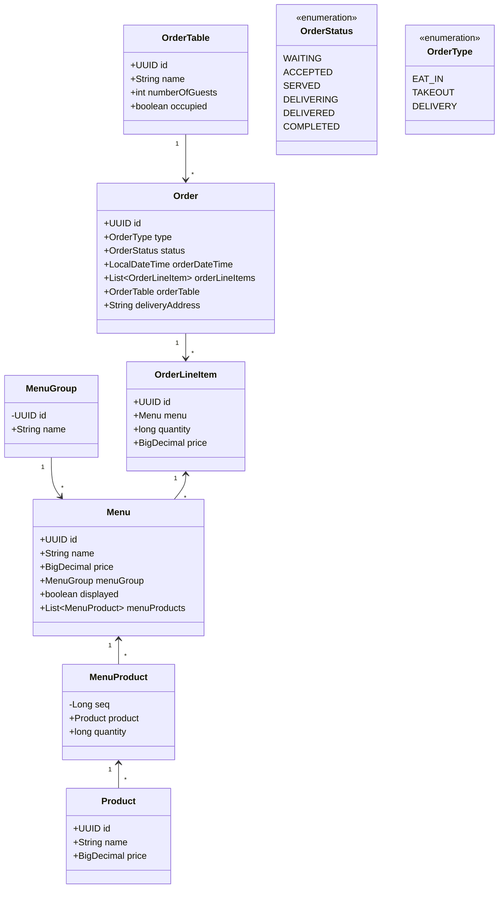

# 키친포스

## 퀵 스타트

```sh
cd docker
docker compose -p kitchenpos up -d
```

## 요구 사항

- [ ] 메뉴 그룹
    - [ ] 메뉴들의 모음인 메뉴 그룹을 생성할 수 있다.
        - 메뉴 그룹의 정보는 이름을 가진다.
            - 최대 255자까지만 지정이 가능하다.
            - 빈값이거나 공백으로만 이뤄질수 없다.
            - ex) 추천메뉴, 메인메뉴, 사이드메뉴
    - [ ] 전체 메뉴 그룹을 조회할 수 있다.
- [ ] 메뉴
    - [ ] 메뉴를 생성할 수 있다.
        - 메뉴 이름, 가격, 속할 메뉴 그룹, 노출 여부, 메뉴에 속한 상품들의 정보가 있다.
        - 메뉴 이름은 255자를 넘을 수가 없다.
            - 빈값이거나 공백으로만 이뤄질수 없다.
        - 메뉴 가격은 메뉴에 속한 상품들의 총합의 가격보다 커야 한다.
            - 가격은 0원 이상이여야 한다.
        - 존재하지 않은 상품은 메뉴가 추가할 수 없다.
        - 존재하지 않을 메뉴 그룹에 메뉴를 추가할 수 없다.
        - 메뉴 그룹에는 상품이 1개 이상 있어야 한다.
        - 비속어가 포함된 메뉴 이름은 지정할 수 없다.
        - 예를들어 아래와 같은 메뉴가 있을수 있다.
            - 이름: 후라이드+양념
            - 가격: 16,000원
            - 메뉴 그룹: 추천매뉴
            - 노출 여부: O
            - 메뉴 상품 목록
                - 후라이드 치킨 1개 8,000원
                - 양념 치킨 1개 8,000원
    - [ ] 메뉴의 가격을 변경할 수 있다.
        - 메뉴의 ID가 있다면 메뉴의 가격을 16,000원에서 15,000원으로 변경 가능하다.
        - 메뉴 가격은 메뉴에 속한 상품들의 총합의 가격보다 커야 한다.
            - 가격은 0원 이상이여야 한다.
    - [ ] 메뉴 노출 여부를 변경가능하다
        - 메뉴를 노출 하게 되면 가격을 한번 더 체크한다.
            - 메뉴 가격은 메뉴에 속한 상품들의 총합의 가격보다 커야 한다.
    - [ ] 전체 메뉴를 조회할 수 있다.
- [ ] 메뉴 상품
    - [ ] 메뉴 상품 정보에는 수량과 상품이 존재한다.
    - [ ] 메뉴에 존재하는 상품의 정보를 저장할 수 있다.
    - [ ] 상품의 수량이 0개 미만인 경우 추가할 수 없다.
- [ ] 주문 테이블
    - [ ] 주문 테이블을 생성 할 수 있다.
        - [ ] 주문 테이블의 정보에는 이름, 손님 수, 착석 여부가 있다.
            - 예를들어 이름은 1번, 2번, 3번 ....
            - 최초 생성시 손님수는 0명이다.
            - 최초 생성 시 착석 여부는 빈 테이블이다.
    - [ ] 손님이 해당 테이블에 착석할 수 있다.
    - [ ] 손님이 간 테이블은 빈 테이블로 변경할 수 있다.
        - 주문이 완료되지 않았다면 테이블을 비울 수 없다.
        - 빈 테이블로 변경할때 손님 수를 0으로 변경한다.
    - [ ] 해당 테이블의 손님 수를 변경할 수 있다.
        - 손님 수는 0명 이상이여야 한다.
        - 테이블 상태가 착석(sit)상태가 아니라면 손님을 변경할 수 없다.
    - [ ] 주문 테이블 전체 조회가 가능하다.
- [ ] 주문
    - [ ] 주문을 생성할 수 있다.
        - 주문 정보에는 주문 유형, 주문 상태, 주문 시간, 주문 내역, 주문 테이블, 배달 주소가 있다.
            - 주문 유형이 배달하기인 경우에만 주문주소가 존재한다.
            - 배달 주소는 255자까지만 입력이 가능하다.
        - 주문한 메뉴가 존재해야 한다.
        - 노출되지 않은 메뉴는 주문할 수 없다.
        - 주문 상태는 먹고가기, 포장하기, 배달하기가 있다.
            - 먹고가기
                - 해당 테이블이 착석 상태만 주문이 가능하다.
            - 포장하기
                - 수량이 0개 미만이면 주문이 불가능하다.
            - 배달하기
                - 수량이 0개 미만이면 주문이 불가능하다.
                - 주문할 주소가 빈값이면 주문이 불가능하다.
    - [ ] 주문을 수락한다.
        - 주문 상태가 대기중이 아닌 경우에 주문을 수락할 수 없다.
        - 주문 타입이 배달하기라면 배달 요청을 진행한다.
        - 주문 상태를 수락으로 변경한다.
    - [ ] 주문을 서빙한다.
        - 주문 상태가 수락인 경우에만 서빙이 가능하다.
        - 주문 상태를 서빙으로 변경한다.
    - [ ] 주문에 대한 배달 시작한다.
        - 주문 타입이 배달이 아닌 경우 배달 시작을 할 수 없다.
        - 주문 상태가 서빙이 아닌 경우 배달 시작을 할 수 없다.
        - 주문 상태를 배달중으로 변경한다.
    - [ ] 주문에 대한 배달 완료 처리가 된다.
        - 주문 상태가 배달중이 아니면 배달 완료를 할 수 없다.
        - 주문 상태를 배달완료로 변경한다.
    - [ ] 주문에 대한 완료 처리가 된다.
        - 주문 타입이 배달하기라면
            - 주문 상태가 배달 완료 상태가 아니라면 주문 완료 처리가 불가능하다.
        - 주문 타입이 포장하기라면
            - 주문 상태가 서빙 상태가 아니라면 주문 완료 처리가 불가능하다.
        - 주문 타입이 먹고가기라면
            - 주문 상태가 서빙 상태가 아니라면 주문 완료 처리가 불가능하다.
            - 해당 테이블을 빈 테이블로 변경한다.
        - 주문 상태를 완료로 변경한다.
    - [ ] 전체 주문을 조회할 수 있다.
- [ ] 주문 아이템
    - [ ] 주문 아이템에는 메뉴, 수량, 가격이 존재한다.
    - [ ] 주문 아이템 가격은 아래와 같은 조건을 갖는다.
        - 메뉴의 가격과 수량을 곱한 값보다 작은 가격 설정이 불가능하다.
- [ ] 상품
    - [ ] 상품 정보에는 이름과 가격이 있다.
    - [ ] 상품을 생성할 수 있다.
        - 상품의 가격이 0 이상이여야 한다.
        - 상품의 이름에 비속어가 포함되어 있으면 생성할 수 없다.
        - 메뉴 이름은 255자를 넘을 수가 없다.
        - 빈값이거나 공백으로만 이뤄질수 없다.
    - [ ] 상품의 가격을 변경할 수 있다.
        - 상품의 가격은 0 이상이여야 한다.
        - 상품 가격이 변경되면 메뉴의 가격도 맞춰서 변경된다.
        - 메뉴의 가격이 상품의 총합보다 크면 메뉴의 노출 상태를 미노출로 변경한다.
        - 상품의 전체 조회가 가능하다.

## 용어 사전

### COMMON

| 한글명 | 영문명      | 설명          |
|-----|----------|-------------|
| 가격  | Price    | 제품 및 메뉴의 가격 |
| 수량  | quantity | 제품의 수량      |

### Menu

| 한글명   | 영문명         | 설명                     |
|-------|-------------|------------------------|
| 메뉴 그룹 | MenuGroup   | 여러개의 메뉴의 카테고리          |
| 메뉴    | Menu        | 주문할 수 있는 상품들의 모음       |
| 메뉴 상품 | MenuProduct | 메뉴 내에 있는 상품            |
| 전시 여부 | displayed   | 실제 판매할 수 있는 메뉴로 전시할 여부 |

### Order

| 한글명    | 영문명             | 설명                                |
|--------|-----------------|-----------------------------------|
| 주문     | Order           | 사용자가 상품들을 주문한 모든 내역이 있는 것         |
| 주문내역   | OrderLineItem   | 사용자가 주문한 각각의 내역                   |
| 배달주소   | deliveryAddress | 주문 유형이 배달인 경우 배달을 해야 할 주소         |
| 주문 상태  | OrderStatus     | 주문이 접수되고 주문자에게 상품이 가기까지의 과정       |
| 대기중    | WAITING         | 주문이 접수되고 수락하기 전 단계                |
| 수락     | ACCEPTED        | 접수되어 수락되어 조리하는 단계                 |
| 제작완료   | SERVED          | 제작 및 조리가 완료된 단계                   |
| 배달중    | DELIVERING      | 실제 주문자에게 배달되는 단계                  |
| 배달완료   | DELIVERED       | 실제 주문자에게 배달이 완료된 단계               |
| 완료     | COMPLETED       | 주문자에게 서빙 및 배달이 완료되어 주문 처리가 완료된 상태 |
| 주문 유형  | OrderType       | 주문이 사용자에게 어떻게 가는지에 대한 유형          |
| 먹고가기   | EAT_IN          | 테이블에서 실제 상품을 먹고가는 유형              |
| 포장하기   | TAKEOUT         | 사용자가 직접 포장해서 가져가는 유형              |
| 배달하기   | DELIVERY        | 상품을 배달에서 사용자가 받는 유형               |
| 주문 테이블 | OrderTable      | 먹고가는 주문자에게 제공되는 좌석                |
| 주문 테이블 | OrderTableName  | 좌석 이름                             |
| 손님     | TableGuest      | 좌석에 앉아 있는 손님                      |
| 착석여부   | occupied        | 주문 테이블에 손님이 착석되어 있는 여부            |

### Product

| 한글명  | 영문명         | 설명        |
|------|-------------|-----------|
| 상품   | Product     | 판매할 상품    |
| 상품이름 | ProductName | 상품에 대한 이름 |

## 모델링

- Menu
    - id: UUID
    - name: String // 메뉴의 이름
    - price: BigDecimal // 메뉴의 가격
    - menuGroup: MenuGroup // 메뉴가 속해져 있는 카테고리
    - display: Boolean // 메뉴의 노출 여부
    - menuProducts: List<MenuProduct> // 메뉴에 속해져 있는 상품들
- MenuGroup
    - id: UUID
    - name: String // 메뉴 그룹의 이름
- MenuProduct
    - id: UUID
    - product: Product // 메뉴에 속해져 있는 상품
    - quantity: long // 상품의 수량
- Order
    - id: UUID
    - type: OrderType // 주문 유형
    - status: OrderStatus // 주문 상태
    - orderDateTime: LocalDateTime // 주문 시간
    - orderLineItems: List<OrderLineItem> // 주문 내역
    - orderTable: OrderTable // 주문 테이블
    - deliveryAddress: String // 배달 주소
- OrderLineItem
    - id: UUID
    - menu: Menu // 주문한 메뉴
    - quantity: long // 메뉴의 수량
    - price: BigDecimal // 가격
- OrderTable
    - id: UUID
    - name: String // 테이블의 이름
    - numberOfGuests: int // 손님 수
    - occupied: boolean // 테이블의 착석 여부
- Product
    - id: UUID
    - name: String // 상품의 이름
    - price: BigDecimal // 상품의 가격


