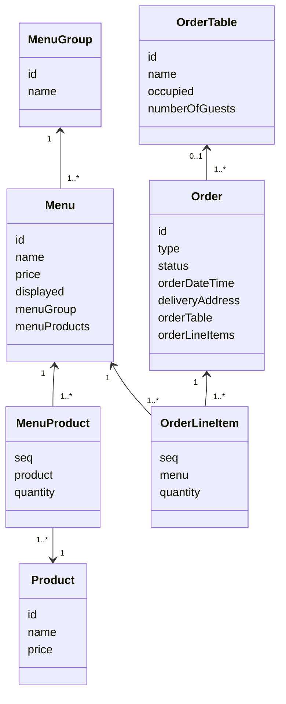
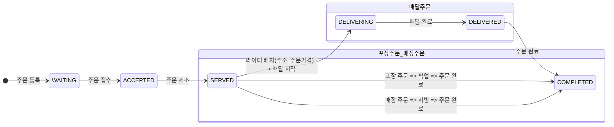

# 키친포스

## 퀵 스타트

```sh
cd docker
docker compose -p kitchenpos up -d
```

## 요구 사항
> 키친 포스 시스템을 구현한다.

### 메뉴 그룹(MenuGroup)
- [x] `1`개 이상의 `메뉴`를 어떤 분류로 목록화 한 것을 `메뉴 그룹`이라고 한다.
  - 예) "추천메뉴" 메뉴그룹에는 "후라이드 치킨", "반반치킨", "순살치킨" 메뉴가 있다.

- [x] 기능) 메뉴그룹을 등록한다.
  - [x] 이름은 공백일 수 없다.

- [x] 기능) 가지고 있는 메뉴그룹 목록을 볼 수 있다.

### 메뉴(Menu)
- [ ] `1`개 이상의 `상품`을 구성한 것을 `메뉴`라고 부르고 고객은 등록된 메뉴를 주문한다.
  - 예) "반반치킨" 메뉴에는 "후라이드"상품, "양념"상품으로 구성되어 있다.
  - 예) 고객은 "반반치킨"메뉴를 주문한다.
- [ ] 메뉴는 이름, 가격, 메뉴노출여부, 메뉴그룹, 메뉴구성 상품을 관리한다.
  - [ ] 메뉴노출여부는 노출함과 노출안함 중에 선택한다.

- [x] 기능) 메뉴를 만들 수 있다.
  - [x] 이름은 공백일 수 없다. 그리고 비속어를 포함하지 않는다.
  - [x] 가격은 `0`원 이상이고 `가격 정책`을 만족해야 한다.
    - [x] `가격 정책`은 입력한 {메뉴의 가격}이 {`메뉴구성 상품`들의 총 합} 보다 비싸지 않아야 한다.
      - 참고) {`메뉴구성 상품`들의 총 합} = {해당 `상품`의 (가격 * 수량)}을 계산한 것들의 합
  - [x] 메뉴는 이미 등록된 하나의 `메뉴 그룹`에 반드시 속한다.
  - [x] 메뉴는 `메뉴구성 상품`을 `한 가지`이상 가진다.
    - [x] `메뉴구성 상품`은 미리 등록된 `상품`과 해당 `상품`의 수량을 `0`개 이상 가진다.

- [x] 기능) 메뉴 가격은 수정된다.
  - [ ] 해당 메뉴가 있는지 체크해야한다.
  - [x] 가격은 공백이 아니고 `0`원 이상이다. 그리고 `가격 정책`을 만족해야 한다.
    - [x] `가격 정책`은 입력한 {메뉴의 가격}이 {`메뉴구성 상품`들의 총 합} 보다 비싸지 않아야 한다.
      - 참고) {`메뉴구성 상품`들의 총 합} = {해당 `상품`의 (가격 * 수량)}을 계산한 것들의 합

- [ ] 기능) 메뉴를 노출할 수 있다.
  - [ ] 해당 메뉴가 있는지 체크해야한다.
  - [ ] 현재 메뉴의 `가격 정책`을 체크해야 한다.
    - [ ] `가격 정책`은 해당 {메뉴의 가격}이 {`메뉴구성 상품`들의 총 합} 보다 비싸지 않아야 한다.
      - 참고) {`메뉴구성 상품`들의 총 합} = {해당 `상품`의 (가격 * 수량)}을 계산한 것들의 합

- [ ] 기능) 메뉴를 보이지 않게 할 수 있다.
  - [ ] 해당 메뉴가 있는지 체크해야한다.
  - [ ] 메뉴 노출 여부를 노출 안함으로 변경한다.

- [ ] 기능) 가지고 있는 메뉴 목록을 볼 수 있다.

### 상품(Product)
- [x] 상품은 다른 것과 구성되지 않은 단품으로 구성된 제품이다. 포스기에서 가장 작은 단위이다.
- [x] 상품은 이름, 가격을 관리한다.

- [x] 기능) 상품을 등록한다.
  - [x] 이름은 공백일 수 없다. 그리고 비속어를 포함하지 않는다.
  - [x] 가격은 공백일 수 없다. 그리고 `0`원 이상이다.

- [x] 기능) 상품의 가격을 수정한다.
  - [x] 가격은 공백일 수 없다. 그리고 `0`원 이상이다.
  - [x] 가격은 `가격 정책`을 체크한다.
  - [x] `가격 정책`은 상품을 포함한 각 {메뉴의 가격}이 아래 조건을 만족하지 않으면 그 `메뉴`는 노출하지 않는다.
    - [x] 각 {메뉴의 가격}은 [{각 메뉴에 해당하는 (`상품` 가격) * (`상품` 수량)}들의 총 합]보다 비싸지 않아야 한다.

- [x] 기능) 상품 목록을 볼 수 있다.

### 주문테이블(OrderTable)
- [ ] 주문 테이블은 매장주문을 위해 사용한다.
- [ ] 주문 테이블은 이름, 고객의 수, 사용 여부를 관리한다.

- [ ] 기능) 주문 테이블을 등록한다.
  - [ ] 이름은 공백일 수 없다.
  - [ ] 고객의 수는 `0`명 이다.
  - [ ] 사용여부는 미사용이 된다.

- [ ] 기능) 고객들이 테이블에 앉는다.
  - [ ] 사용여부는 사용중이 된다.

- [ ] 기능) 주문 테이블을 초기화 한다.
  - [ ] `주문`의 주문상태가 **주문완료**이어야 한다.
  - [ ] 사용여부는 미사용이 된다.
  - [ ] 고객의 수는 `0`명이다.

- [ ] 기능) 테이블의 인원을 변경한다.
  - [ ] 주문 테이블은 사용여부가 사용중이어야 한다.
  - [ ] 고객의 수는 `0`명 이상이다.

- [ ] 기능) 주문 테이블 목록을 볼 수 있다.

### 주문(Order)
- [ ] `메뉴`를 `1`개 이상 고른 후 `주문`한다.
- [ ] 주문은 주문종류, 주문상태, 주문시간, `주문메뉴항목`, 배달주소, `주문테이블`을 관리한다.
  - 주문종류는 "배달", "포장", "매장"이 있다.
    - [ ] 배달 : 배달 업체를 통해 주문을 받고, 메뉴들을 배달원에게 전달하면 해당 주소로 배달된다.
    - [ ] 포장 : 포장을 원하는 고객이 주문하면, 고객은 메뉴들을 직접 들고간다.
    - [ ] 매장 : 매장에 방문한 고객이 테이블에서 메뉴를 주문하면, 테이블에 메뉴들을 서빙한다.
  - 주문상태는 "수락대기", "주문수락", "제조완료", "배달중", "배달완료", "주문종료"가 있다.
    - 아래에 [모델링 > 주문상태프로세스](#주문-상태-프로세스) 를 보면서 프로세스 이해한다.
  - [ ] 주문시간은 고객이 주문을 요청한 시간이다.
  - [ ] `주문메뉴항목`은 주문내역에 들어간 메뉴이다.
    - [ ] 주문메뉴항목은 `메뉴`, 수량, 가격을 관리한다.

- [ ] 기능) 주문이 들어왔습니다. (주문~ 주문~)
  - [ ] `주문메뉴항목`은 `1`개이상 포함한다.
  - [ ] `주문메뉴항목`은 이미 만들어진 `메뉴`에서 선택한다.
    - [ ] 주문종류가 매장주문이 아니면 해당 `메뉴`의 수량은 `0`이상이어야 한다.
    - [ ] `메뉴`는 노출된 상태여야 한다.
    - [ ] 각각의 **원래 `메뉴`의 가격**이 **현재 주문 시 요청한 메뉴의 가격**과 같아야 한다.
  - [ ] 주문이 등록될 때는 주문상태는 **수락대기중**이다.
    - [ ] **배달주문**이면 배달주소를 알아야 한다.
    - [ ] **매장주문**이면 이미 등록되어 있는 하나의 `주문 테이블`을 선택한다.
      - [ ] `주문 테이블`은 사용 중이어야 한다. (미리 주문테이블을 선택해야한다.)

- [ ] 기능) 주문접수를 수락한다.
  - [ ] 현재 주문 상태는 **수락대기** 상태여야 한다.
  - [ ] 주문 종료가 배달주문일 때, 배달을 요청한다.
    - [ ] {주문의 총 가격}을 계산한다.
      - [ ] {주문의 총 가격} = 모든 {`주문메뉴항목`의 (가격 * 수량)} 들의 총 합
    - [ ] 배달 요청 할 때 {주문의 총 가격}과 배달 주소를 보내준다.
  - [ ] 주문 상태는 **주문수락** 상태로 변경한다.

- [ ] 기능) 주문의 제조가 완료된다.
  - [ ] 현재 주문 상태는 **주문수락** 상태여야 한다.
  - [ ] 주문 상태는 **제조완료** 상태로 변경한다.

- [ ] 기능) 배달이 시작된다.
  - [ ] 주문종류는 **배달주문**이여야 한다.
  - [ ] 현재 주문 상태는 **제조완료** 상태여야 한다.
  - [ ] 주문 상태는 **배달중** 상태로 변경한다.

- [ ] 기능) 배달이 완료된다.
  - [ ] 현재 주문 상태는 **배달중** 상태여야 한다.
  - [ ] 주문 상태는 **배달완료** 상태로 변경한다.
  - 
- [ ] 기능) 주문이 종료된다.
  - [ ] 주문종류가 **배달주문**라면 
    - [ ] 현재 주문 상태는 **배달완료** 상태이다.
    - [ ] 주문 상태는 **주문완료** 상태로 변경한다.
  - [ ] 주문종류가 **포장주문** 라면
    - [ ] 현재 주문 상태는 **제조완료** 상태이다.
    - [ ] 주문 상태는 **주문완료** 상태로 변경한다.
  - [ ] 주문종류가 **매장주문** 라면
    - [ ] 현재 주문 상태는 **제조완료** 상태이다.
    - [ ] 주문 상태는 **주문완료** 상태로 변경한다.
    - [ ] 주문 테이블은 초기화 된다.
      - [ ] 현재 모든 `주문`의 주문 상태는 **주문완료** 상태이다.
      - [ ] 테이블은 사용여부는 미사용이 된다.
      - [ ] 테이블의 고객의 수는 `0`명 이다.

- [ ] 기능) 주문 목록을 볼 수 있다.

## 용어 사전

| 한글명     | 영문명           | 설명                                              |
|---------|---------------|-------------------------------------------------|
| 키친포스    | Kitchenpos    | 음식점에서 주문이나 메뉴 관리를 할 수 있는 장치                     |
| 메뉴그룹    | MenuGroup     | 1개 이상의 `메뉴`를 어떤 분류로 목록화한 것                      |
| 메뉴      | Menu          | 1개 이상의 `상품`을 구성한 것, 고객이 주문하는 것                  |
| 비속어     | Profanity     | 공격적이거나 외설적인 말 또는 어구                             |
| 상품      | Product       | 다른 것과 구성되지 않은 단품으로 구성된 제품이다. 가장 작은 단위이다.        |
| 메뉴구성 상품 | MenuProduct   | 어떤 `메뉴`에 들어가는 `상품`을 의미한다. 수량 정보도 함께 관리한다.       |
| 메뉴노출여부  | displayed     | `메뉴` 노출 여부를 알 수 있다. (true = 노출함, false = 노출안함)  |
| 가격정책    | PricePolicy   | 메뉴 가격을 체크하는 정책이다. 상품 단가들의 총 합보다 메뉴의 가격은 비싸지 않다. |
| 주문테이블   | OrderTable    | 매장주문 고객이 주문하는 공간. 고객인원 정보도 포함한다.                |
| 테이블사용여부 | Occupied      | 매장고객이 이용하는 주문테이블이 사용된 상태 (true = 사용함, false = 사용안함) |
| 주문메뉴항목  | OrderLineItem | 주문내역에 들어간 메뉴                                    |

### 주문종류(OrderType) : 주문한 메뉴를 어떻게 받을지에 대한 종류
| 한글명    | 영문명     | 설명                       |
|---------|---------------|--------------------------|
| 배달주문    | DELIVERY      | 주문종류 중 배달 방식, 배달 외부업체 이용 |
| 포장주문    | TAKEOUT       | 주문종류 중 포장 방식             |
| 매장주문    | EAT_IN        | 주문종류 중 매장 방식, 테이블 이용     |

### 주문상태(OrderStatus) : 주문한 메뉴를 어떻게 받을지에 대한 종류
| 한글명  | 영문명     |                                 |
|------|---------------|---------------------------------|
| 수락대기 | WAITING       | 수락 대기 중. 주문하고 접수 수락이 되기 전 상태    |
| 주문수락 | ACCEPTED      | 주문 수락. 접수된 주문을 확인하고 제조를 진행하는 상태 |
| 제조완료 | SERVED        | 제조가 완료되었다는 상태                   |
| 배달중  | DELIVERING    | 배달 주문일 때 배달이 시작되고 배달 완료 전까지 상태  |
| 배달완료 | DELIVERED     | 배달 주문일 때 고객에게 메뉴들이 도착한 상태       |
| 주문종료 | COMPLETED     | 주문이 잘 처리되어 완료된 상태               |


## 모델링

### 클래스 관계도


#### 주문 상태 프로세스



-----------------------------------------------------------------------------------------------------
---
# 도메인 주도 설계 이해

## 1단계 - 문자열 덧셈 계산기

### 요구 사항

- 컴마(,) 또는 콜론(:)을 구분자로 가지는 문자열을 전달하는 경우 구분자를 기준으로 분리한 각 숫자의 합을 반환 (예: “” => 0, "1,2" => 3, "1,2,3" => 6, “1,2:3” => 6)
- 앞의 기본 구분자(쉼표, 콜론) 외에 커스텀 구분자를 지정할 수 있다. 커스텀 구분자는 문자열 앞부분의 “//”와 “\n” 사이에 위치하는 문자를 커스텀 구분자로 사용한다.<br>
  예를 들어 “//;\n1;2;3”과 같이 값을 입력할 경우 커스텀 구분자는 세미콜론(;)이며, 결과 값은 6이 반환되어야 한다.
- 문자열 계산기에 숫자 이외의 값 또는 음수를 전달하는 경우 `RuntimeException` 예외를 throw 한다.

### 기능 목록
- [x] 유효한 문자열에 대해 음수가 아닌 숫자로 반환하는 기능
  - [x] 문자열을 입력받아 음수나 숫자가 아닌 문자를 입력받으면 예외 발생
  - [x] 정적 팩토리 메서드 사용하여 Number 생성.
  - [x] `empty`이나 `null`에 대해 0 반환 (더하여 blank 처리도...)
  - [x] 숫자일 경우 숫자 한개만 반환
  - [x] 덧셈 기능 추가
- [x] 요구사항에 따른 구분자 관련된 기능
  - [x] 컴마와 콜론에 대한 처리
  - [x] custom 구분자에 대한 처리
- [x] 합을 반환하는 기능
  - [x] 숫자가 두개 이상일 경우를 생각해서 숫자 리스트를 일급 객체로 반환

### 리뷰사항 반영 목록
- [x] 예외 상세메세지에 실패 관련 정보도 담기
- [x] 테스트 코드에서의 과도한 구현 제거
- [x] DisplayName 다듬기와 테스트 코드에 디스플레이 네임 작성 이유와 역할 생각해보기
  - 가독성 향상 : 테스트 케이스를 읽는 사람이 해당 테스트 케이스가 어떤 동작을 수행하는지 쉽게 이해하기 위해 사용
  - 유지보수성 향상 : 테스트 코드의 의도를 더 쉽게 파악할 수 있어 테스트 코드 수정시 어떤 부분을 수정해야하는지 더 빠르게 파악 가능
  - 테스트 결과 이해 : 테스트 케이스의 결과를 파악하는것이 더 쉬워짐.
- [x] NumbersParserUtils의 생성자에서 exception 을 던져서 내부에서도 생성을 못하도록 막아ㅇ주기
- [x] 테스트 코드가 작성되지 않은 클래스 테스트 코드 작성하기
  - [x] 전략패턴 관련한 테스트
  - [x] NumberParserUtils 테스트

---

## [🚀 2단계 - 요구 사항 정리]

### 요구 사항
- `kitchenpos` 패키지의 코드를 보고 키친포스의 요구 사항을 `README.md`에 작성한다.

### 요구사항 흐름 정리
> 아래의 순서대로 해당 미션의 요구사항을 정리한다.

- [x] 도메인 요구사항의 목표를 작성한다. 
- 코드 분석한 내용을 작성한다.
  - [x] `kitchenpos` 패키지의 코드를 보고 추론해본다.
    - [x] Product
    - [x] Menu
    - [x] MenuGroup
    - [x] Order
    - [x] OrderTable
    - [x] 매핑 테이블 정리
    - [x] 분생각해 볼 추가 요구사항 분석
    > - Table 의 구조를 파악한다.
    > - http 디렉터리의 .http 파일(HTTP client)을 보고 어떤 요청을 받는지 참고한다.
    > - 각 요청의 흐름 순서대로 분석해보자.
    > - 개발적인 요소들이 포함되도 좋으니 일단 작성해보자.
- 작성된 초안을 참고하여 요구사항을 작성한다.
  - [x] 필요한 도메인 모델링 작성
  - [x] 유비쿼터스 언어를 아래 `용어사전`에 정의한다.
  - [x] 사용자가 사용하는 진입 경로 순서로 요구사항을 목록화 한다.
- 요구사항을 리팩토링 한다.
  - [x] 작성한 요구사항이 모두가 합의할 수 있는 내용인지 확인한다.
  - [x] 도메인 전문가나 도메인 이해관계자가 이해할 수 있는 언어로 작성되어있는지 확인한다.
  - [x] 오탈자나 어색한 문맥이 있는지 확인한다.


---

[🚀 3단계 - 테스트를 통한 코드 보호]

- 정리한 키친포스의 요구 사항을 토대로 테스트 코드를 작성한다.
  - [ ] 모든 Business Object에 대한 테스트 코드를 작성한다.
    - [x] `@ExtendWith(MockitoExtension.class)`를 이용한 단위 테스트 코드를 작성한다.
      - [x] MockTest를 위한 기본 세팅
  - [ ] Controller : Acceptance Test 추가
    - [x] 기본 셋팅
      - [x] RestAssured 라이브러리 추가 및 구글 API 전송
      - [x] 공통 AcceptanceTest 셋팅
      - [x] Database Test 격리
    - [ ] 기능 별 인수테스트 추가
      - 위의 요구사항 보면서 체크하기.
