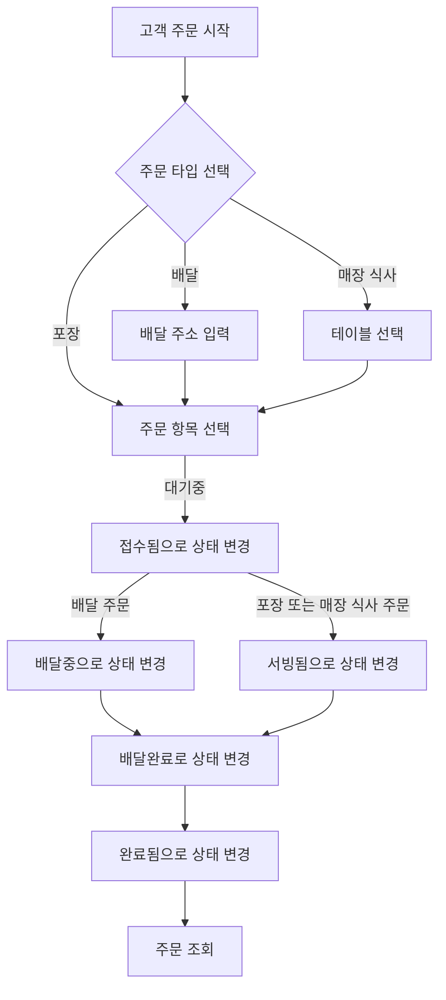

# 키친포스

## How to run

```sh
cd docker
docker compose -p kitchenpos up -d
```

## 요구 사항

- 메뉴 애그리거트과 주문 애그리거트으로 구분 될 수 있습니다.

## Menu Aggregate

### MenuGroup

- **메뉴 그룹**는 하나 이상의 **메뉴**로 구성될 수 있습니다.
- **메뉴 그룹**은 각각 고유한 걔념을 가질 수 있습니다.
    - 고유한 걔념은 속한 **메뉴**들의 개성을 설명합니다.
    - ex. `추천메뉴` ,`순살메뉴` ,`한마리메뉴` ,`신메뉴` ,`두마리메뉴`
- **메뉴 그룹**은 `식별자` 와 `이름`으로 구성됩니다.
    - `식별자`는 중복되지 않은 랜덤한 값으로 부여됩니다.
    - `이름`은 중복되지 않는 고유한 값이어야 합니다.
    - `이름`은 비속어를 포함하지 않아야 합니다.
- **메뉴 그룹**은 새로 등록 될 수 있습니다.
    - 등록 시 `식별자`는 자동으로 부여됩니다.
    - 등록 시 중복되지 않는 `이름`을 등록해야합니다.
    - `이름`은 비속어를 포함하지 않아야 합니다.
- **메뉴 그룹**을 조회할 수 있습니다.

### Product

- **메뉴**는 하나 이상의 **상품**으로 구성될 수 있습니다.
    - 예를 들어 `후라이드 치킨 세트` **메뉴**에는 `후라이드 치킨`과 `콜라`가 포함될 수 있습니다.
    - 여기서 `후라이드 치킨`과 `콜라`는 각각 **상품**입니다.
- **상품**의 상품은 `식별자, 이름, 가격`으로 구성됩니다.
    - `식별자`는 중복되지 않은 랜덤한 값으로 부여됩니다.
    - `이름`은 중복되지 않는 고유한 값이어야 합니다.
    - `이름`은 비속어를 포함하지 않아야 합니다.
    - `가격`은 0보다 큰 값이어야 합니다.
- **상품**은 새로 등록 될 수 있습니다.
    - 등록 시 `식별자`는 자동으로 부여됩니다.
    - 등록 시 비속어가 아닌 중복되지 않는 `이름`을 필수적으로 등록해야합니다.
    - 등록 시 0 이상의 `가격`을 필수적으로 등록해야합니다.
- **상품**의 가격을 수정할 수 있습니다.
    - 상품의 가격은 0보다 큰 값이어야 합니다.
- **상품**을 조회할 수 있습니다.

### Menu Product

- **메뉴 상품**은 **상품**이 **메뉴**에 어떻게 구성되어 있는지를 나타냅니다..
    - 예를 들어 `후라이드 치킨 세트` **메뉴**에는 `후라이드 치킨`과 `콜라`  **상품**이 각각 1개씩 포함될 수 있습니다.
    - 혹은 `양념 두마리 치킨 세트` **메뉴**에는 `양념 치킨`이 2마리가 포함될 수 있습니다.
- **메뉴 상품**은 메뉴 등록 시 하나 이상 등록이 필요합니다
- **메뉴 상품**은 `식별자`,`수량`,`상품식별자`,`메뉴식별자`로 구성됩니다.
    - `식별자`는 메뉴와 함께 등록시 자동으로 부여되는 값입니다.
    - `수량`은 1 이상의 값이어야 합니다.
    - `상품식별자`는 상품의 식별자입니다. **상품**의 식별자와 연결됩니다.
    - `메뉴식별자`는 메뉴의 식별자입니다. **메뉴** 식별자와 연결됩니다.

### Menu

- **주문**은 하나 이상의 **메뉴**로 구성될 수 있습니다.
- 하나의 **메뉴** 안에 여러 **상품**이 포함될 수 있습니다.
    - **메뉴**는 **메뉴 상품**을 통해 구성 메뉴를 파악할 수 있습니다.
- **메뉴** 는 `식별자, 화면표시여부, 이름, 가격, 메뉴그룹식별자`로 구성됩니다.
    - `식별자`는 중복되지 않은 랜덤한 값으로 부여됩니다.
    - `화면표시여부`는 메뉴가 화면에 표시되는지 여부를 나타냅니다.
    - `이름`은 중복되지 않는 고유한 값이어야 합니다.
    - `이름`은 비속어를 포함하지 않아야 합니다.
    - `가격`은 0보다 큰 값이어야 합니다.
    - `가격`은 최소 0.01원부터 최대 9999999999999999999.99원까지 표현할 수 있습니다.
    - `메뉴그룹식별자`는 어느 메뉴그룹에 속하는지 확인하는 값입니다. **메뉴 그룹**의 식별자와 연결됩니다.
- **메뉴**는 새로 등록 될 수 있습니다.
    - 등록 시 `식별자`는 자동으로 부여됩니다.
    - 등록 시 중복되지 않는 `이름`을 등록해야합니다.
    - 등록 시 0 이상의 `가격`을 등록해야합니다.
    - 등록 시 `메뉴그룹식별자`는 메뉴 그룹의 식별자와 연결되어야합니다.
    - 등록 시 하나 이상의 `메뉴상품`을 함께 등록해야합니다.
- **메뉴**의 가격을 수정할 수 있습니다.
    - 수정 시 `가격`은 필수입니다.
    - 메뉴의 가격은 0보다 큰 값이어야 합니다.
- **메뉴**를 화면에 표시할 수 있습니다.
- **메뉴**를 화면에서 숨길 수 있습니다.
- **메뉴**를 조회할 수 있습니다.

## Order Aggregate

### Order

- 고객은 **주문**을 생성할 수 있습니다.
- **주문**은 하나 이상의 **주문 항목**으로 구성됩니다.
- 고객은 `배달`, `포장`, `매장 식사` 중 하나를 선택해 주문 할 수 있습니다.
- 고객은 `배달` 타입의 주문시 배달 주소를 제공해야한다.
- 고객은 `매장 식사` 타입의 주문시 테이블을 선택해야한다.
- **주문**은 `식별자`, `배달 주소`, `주문 일시`, `상태`, `타입`, `테이블 식별자`로 구성됩니다.
    - `식별자`는 중복되지 않은 랜덤한 값으로 부여됩니다.
    - `배달 주소`는 `배달` 주문일 때 필수입니다. `포장`, `매장 식사` 주문일 때는 무시됩니다.
    - `주문 일시`는 주문 시점의 시간입니다.
    - `상태`는 주문 상태입니다.   `대기중`, `접수됨`, `서빙됨`, `배달중`, `배달완료`, `완료됨` 중 하나입니다.
        - 최초 주문 시 `상태`는 `대기중`으로 설정됩니다.
        - `대기중` 상태에서는 `접수됨` 상태로 변경됩니다.
        - 주문 타입에 따라 `서빙됨` 혹은 `배달중` 상태로 변경됩니다.
            - `배달` 주문일 때는 `배달중` 상태로 변경됩니다.
            - 배달 완료 시 `배달완료` 상태로 변경됩니다.
        - 모든 주문이 완료 시 `완료됨` 상태로 변경됩니다.
    - `타입`은 주문 타입입니다. `배달`, `포장`, `매장 식사` 중 하나입니다.
    - `테이블식별자`는 `매장 식사` 주문 시 필수입니다.
    - 요청 시 하나 이상의 `주문 항목`를 함께 등록해야합니다.
- 주문을 조회 할 수 있습니다.

#### 주문 처리 흐름



### OrderLineItem

- 하나의 **주문**에는 여러 **메뉴**가 포함될 수 있습니다.
- 하나의 **메뉴**는 여러 **주문**에 포함될 수 있습니다.
- **주문**은 하나 이상의 **메뉴**로 구성될 수 있습니다.
    - **주문**은 **주문 항목**을 통해 **메뉴**를 파악할 수 있습니다.
- **주문 항목**은 `식별자`, `수량`, `메뉴 식별자`, `주문 식별자`로 구성됩니다.
    - `식별자`는 자동 증가되는 값입니다.
    - `수량`은 주문하는 메뉴의 수량을 의미합니다.
    - `수량`은 1 이상의 값이어야 합니다.
    - `메뉴 식별자`는 메뉴의 식별자입니다. **메뉴**의 식별자와 연결됩니다.
    - `주문 식별자`는 주문의 식별자입니다. **주문**의 식별자와 연결됩니다.
- **주문**을 생성 시 하나 이상의 **주문 항목**을 필수적으로 포함해야합니다.
    - `주문 식별자` , `가격` , `수량` 은 필수입니다.
    - `가격`은 0보다 큰 값이어야 합니다.
    - `수량`은 1 이상의 값이어야 합니다.
    - `메뉴 식별자`는 메뉴의 식별자입니다. **메뉴**의 식별자와 연결됩니다.

### OrderTable

- 테이블은 매장의 좌석을 의미합니다.
- 고객이 주문 시 `매장식사` 일 경우 `테이블 식별자` 참조 해야합니다.
- 만약 모든 좌석이 사용 중일 경우 `매장식사`를 할 수 없습니다.
- **테이블**은 `식별자`, `이름`, `좌석수`, `사용여부`로 구성됩니다.
    - `식별자`는 중복되지 않은 랜덤한 값으로 부여됩니다.
    - `이름`은 중복되지 않는 고유한 값이어야 합니다.
    - `이름`은 비속어를 포함하지 않아야 합니다.
    - `좌석수`는 테이블의 좌석수를 의미합니다.
    - `사용여부`는 테이블의 사용 여부를 나타냅니다.
- **테이블**을 등록할 수 있습니다.
    - 등록 시 `식별자`는 자동으로 부여됩니다.
    - 등록 시 중복되지 않는 `이름`을 등록해야합니다.
    - 등록 시 `좌석수`는 0보다 큰 값이어야 합니다.
- **테이블**의 사용 여부를 변경할 수 있습니다.
    - `사용여부`는 `사용중`, `비어있음` 중 하나입니다.
    - `사용중` 에서  `비어있음` 으로 변경 시 주문의 상태가 `완료됨` 이어야 합니다.
- **테이블**의 `좌석수`를 변경할 수 있습니다.
    - `좌석수`는 0보다 큰 값이어야 합니다.
    - `사용중` 인 테이블의 `좌석수`는 변경할 수 없습니다.

### 모델링 참고


