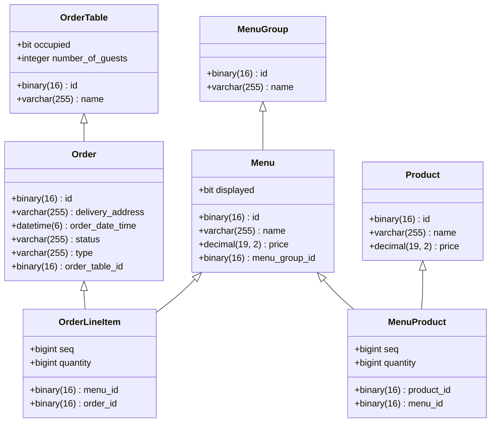

# 키친포스

## 퀵 스타트

```sh
cd docker
docker compose -p kitchenpos up -d
```

## 요구 사항

## 용어 사전

| 한글명 | 영문명 | 설명 |
|-----|-----|----|
|     |     |    |

## 모델링


```mermaid
classDiagram

%% 모델간 관계
    Order <|-- OrderLineItem
    MenuGroup <|-- Menu
    Menu <|-- MenuProduct
    Menu <|-- OrderLineItem
    Product <|-- MenuProduct
    OrderTable <|-- Order
%% 메뉴의 구성
    Menu: +binary(16) id
    Menu: +bit displayed
    Menu: +varchar(255) name
    Menu: +decimal(19, 2) price
    Menu: +binary(16) menu_group_id
%% 메뉴 그룹의 구성
    MenuGroup: +binary(16) id
    MenuGroup: +varchar(255) name
%% 메뉴와 상품의 관계
    MenuProduct: +bigint seq
    MenuProduct: +bigint quantity
    MenuProduct: +binary(16) product_id
    MenuProduct: +binary(16) menu_id
%% 주문의 구성
    OrderLineItem: +bigint seq
    OrderLineItem: +bigint quantity
    OrderLineItem: +binary(16) menu_id
    OrderLineItem: +binary(16) order_id
%% 주문 테이블의 구성
    OrderTable: +binary(16) id
    OrderTable: +bit occupied
    OrderTable: +varchar(255) name
    OrderTable: +integer number_of_guests
%% 주문의 구성
    Order: +binary(16) id
    Order: +varchar(255) delivery_address
    Order: +datetime(6) order_date_time
    Order: +varchar(255) status
    Order: +varchar(255) type
    Order: +binary(16) order_table_id
%% 상품의 구성
    Product: +binary(16) id
    Product: +varchar(255) name
    Product: +decimal(19, 2) price
```
