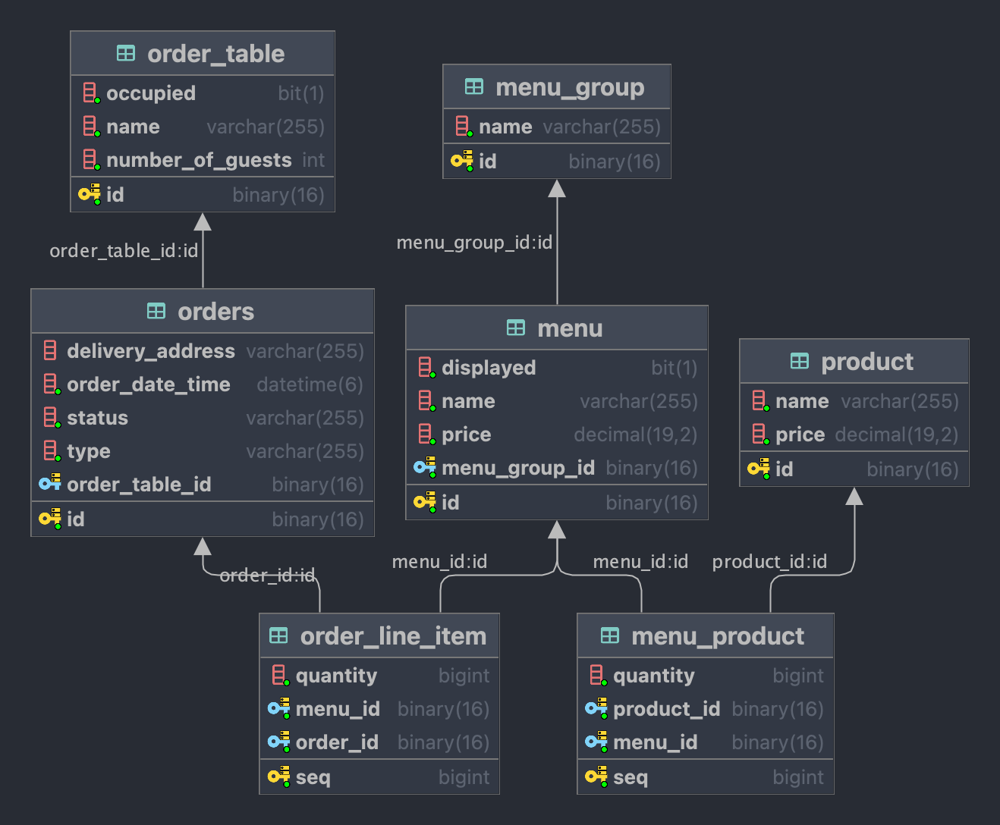

# 키친포스

## 퀵 스타트

```sh
cd docker
docker compose -p kitchenpos up -d
```

## 요구 사항

- 식당 관리 프로그램을 구현한다.
- 상품
  - [ ] 속성 
    - [ ] 상품은 상품명과 가격을 가진다.
      - [ ] 상품명을 반드시 지정해야 하며, 비속어를 포함되어서는 안된다.
      - [ ] 가격은 0원 이상이어야 한다.
  - [ ] use-case
    - [ ] 상품을 등록할 수 있다. 
    - [ ] 상품의 가격을 변경할 수 있다.
    - [ ] 상품 가격이 변경되면 그 상품을 포함한 메뉴의 가격도 변경해야 한다.
    - [ ] 모든 상품을 조회할 수 있다.
- 메뉴 그룹
  - [ ] 속성 
    - [ ] 메뉴 그룹은 이름을 가진다.
      - [ ] 메뉴 그룹의 이름을 반드시 지정해야 한다.
  - [ ] use-case
    - [ ] 메뉴 그룹을 생성할 수 있다.
    - [ ] 모든 메뉴 그룹을 조회할 수 있다.
- 메뉴
  - [ ] 속성 
    - [ ] 메뉴는 여러 개의 상품을 포함할 수 있다.
      - [ ] 메뉴의 포함된 상품은 수량을 가진다.
      - [ ] 수량은 0개 이상이어야 한다.
    - [ ] 이름, 가격, 노출 여부 등을 가진다.
      - 메뉴의 가격은 0원 이상이어야 한다.
      - 메뉴 가격은 각 상품의 (상품 가격 * 수량) 의 합이어야 한다.
    - [ ] 메뉴는 반드시 메뉴 그룹에 포함되어야 한다.
  - [ ] use-case
    - [ ] 메뉴를 생성할 수 있다.
    - [ ] 메뉴의 가격을 바꿀 수 있다.
    - [ ] 메뉴 노출 여부를 수정할 수 있다.
    - [ ] 모든 메뉴를 조회할 수 있다.
- 테이블
  - [ ] 속성
    - [ ] 테이블은 이름, 예약한 손님 수, 점유 여부 등을 가진다.
      - [ ] 테이블 이름을 반드시 지정해야 한다.
      - [ ] 손님 수는 0명 이상이다.
      - [ ] '점유되지 않은 상태'일 때는 손님 수가 0명이다.
  - [ ] use-case
    - [ ] 테이블을 생성할 수 있다.
      - [ ] 이 때, 테이블을 '점유되지 않은 상태'로 생성한다.
    - [ ] 테이블의 손님 수를 변경할 수 있다.
      - [ ] 점유된 테이블은 손님 수를 변경할 수 없다.
    - [ ] 테이블을 점유할 수 있다.
    - [ ] 테이블 점유를 해제할 수 있다.
      - [ ] 주문이 완료된 경우에만 점유를 해제할 수 있다.
      - [ ] 점유를 해제하면 테이블을 '점유되지 않은 상태'로 만든다.
    - [ ] 모든 테이블을 조회할 수 있다.
- 주문
  - [ ] 속성
    - [ ] 주문은 타입, 상태, 주문 시간을 항상 가지고 있다.
    - [ ] 주문한 메뉴와 그 메뉴의 수량을 기록해야 한다.
    - [ ] 최소 한 개의 주문이 있어야 한다.
    - [ ] 홀 주문은 경우, 테이블을 점유하고 주문에 테이블도 기록한다.
    - [ ] 배달 주문은 주소를 기록해야 한다.
  - [ ] use-case
    - [ ] 주문을 생성할 수 있다.
      - [ ] 새로 생성될 주문은 속성에 정의한 조건을 만족해야 한다.
      - [ ] 최초 주문 상태는 '대기중'이다.
      - [ ] 주문 시간도 기록한다.
      - [ ] 식당이 제공하지 않는 메뉴가 주문에 포함되어있지 않은지 확인한다.
    - [ ] 주문을 수락할 수 있다.
      - [ ] 대기중인 주문만 수락할 수 있다.
      - [ ] 배달 주문의 경우, 라이더스에 주문 번호, 가격, 배달 위치를 전달해야 한다.
      - [ ] 주문 상태를 '수락됨' 으로 변경한다.
    - [ ] 주문 서빙을 할 수 있다.
      - [ ] '수락됨' 상태의 주문만 서빙할 수 있다.
      - [ ] 주문 상태를 '서빙됨' 으로 변경한다.
    - [ ] 배달을 시작할 수 있다.
      - [ ] 배달 주문이고, '서빙됨' 상태일 때만 배달을 시작할 수 있다.
      - [ ] 주문 상태를 '배달중' 으로 변경한다.
    - [ ] 배달 완료 처리할 수 있다.
      - [ ] 배달 주문이고, '배달중' 상태일 때만 배달 완료 처리가 가능하다.
      - [ ] 주문 상태를 '배달완료' 로 변경한다.
    - [ ] 주문을 완료 처리할 수 있다.
      - [ ] 배달 주문인 경우, '배달완료' 인 상태일 때만 완료 처리할 수 있다.
      - [ ] 테이크아웃, 홀 주문인 경우 '서빙됨' 상태일 때만 완료 처리할 수 있다.
      - [ ] 홀 주문을 완료 처리하면 테이블은 '점유되지 않은 상태'로 변경되어야 한다.
      - [ ] 주문 상태를 '완료' 로 변경한다.
    - [ ] 모든 주문을 조회할 수 있다.


## 용어 사전

| 한글명   | 영문명         | 설명                                  |
|-------|-------------|-------------------------------------|
| 메뉴 그룹 | menu_group  | 여러 개의 메뉴를 그룹핑한다.                    |
| 메뉴    | menu        | 상품 목록과 각 상품의 개수로 이루어진다. 주문 최소 단위이다. |
| 상품    | product     | 식당에서 취급하는 물건                        |
| 테이블   | order_table | 식당 홀 테이블을 가리킨다.                     |
| 주문    | order       | 고객이 요청한 주문을 가리킨다.                   |
| 주문 상태 | order_status | 주문이 얼마나 진행되었는지를 나타낸다.               |
| 주문 종류 | order_type | 홀에서 식사, 포장, 배달 주문을 구별한다.            |
| 라이더스 | Kitchenriders | 배달 기사 중개 서비스.                       |


## 모델링

