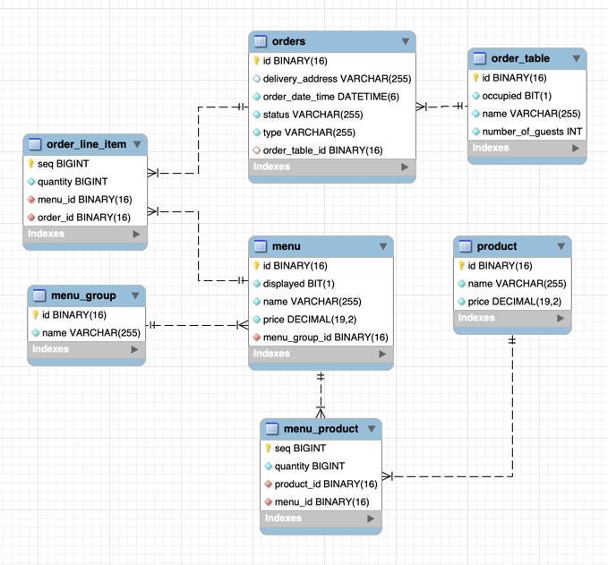

# 키친포스

## 퀵 스타트

```sh
cd docker
docker compose -p kitchenpos up -d
```

## erd


## 요구 사항

### 메뉴 그룹
- [ ] 메뉴 그룹은 N개의 메뉴를 가질 수 있다.
- [ ] 메뉴그룹 이름은 null일 수 없다.
- [ ] 메뉴그룹 이름은 비어있을 수 없다.

### 메뉴
- 생성
- [ ] 메뉴 가격은 null일 수 없다.
- [ ] 메뉴 가격은 음수일 수 없다.
- [ ] 메뉴는 특정 메뉴 그룹에 항상 속해야 한다.
- [ ] 메뉴는 N 개의 메뉴 상품을 가진다.
- [ ] 메뉴에 속한 상품은 모두 존재해야 한다.
- [ ] 메뉴의 가격은 각 상품의 가격 * 각 상품의 재고 수 보다 클 수 없다.
- [ ] 메뉴 이름은 null일 수 없다.
- [ ] 메뉴 이름에는 욕설이 포함될 수 없다.

- 가격 변경
- [ ] 가격은 null이거나 음수일 수 없다.
- [ ] 가격을 변경하고자 하는 메뉴는 반드시 존재해야 한다.
- [ ] 변경하고자 하는 가격이 현재 가격과 같아선 안된다.

- 전시
- [ ] 메뉴는 반드시 존재해야 한다.
- [ ] 메뉴가 가지고 있는 각 메뉴 상품의 가격(수량 * 상품 가격)이 메뉴의 가격보다 작아야한다.    //조건이 이상한데?, 생성 조건이랑 다름.

- 미전시
- [ ] 메뉴는 반드시 존재해야 한다.

### 메뉴 상품
- 메뉴 상품은 메뉴에 포함된 각 상품의 수량를 관리한다.
- [ ] 메뉴 상품은 언제나 상품을 갖는다. (not null)
- [ ] 메뉴에 포함된 각 상품 수량이 음수일 수는 없다.

### 상품
생성
- [ ] 상품의 가격은 null이거나 음수여서는 안된다.
- [ ] 상품의 이름은 null이거나 욕설이 포함돼서는 안된다.

가격 변경
- [ ] 가격은 null이거나 0보다 작아서는 안된다.
- [ ] 상품은 존재해야 한다.
- [ ] 상품의 가격을 변경한 뒤, 상품을 들고있는 메뉴들의 가격 제약조건은 성립되어야 한다.(메뉴 가격이 전체 상품의 합보다 작아야함.)
    - [ ] 만일 만족하지 않는다면 메뉴를 미전시 상태로 바꾼다.

### OrderLineItem
- OrderLineItem은 주문에 포함된 각 메뉴의 수량을 관리한다.
- [ ] OrderLineItem 의 메뉴는 항상 존재해야 한다(메뉴가 없으면 안됨).
- [ ] 홀에서 먹을 경우, 수량은 음수를 허용한다.
- [ ] 홀이 아닐경우, 음수를 허용하지 않는다.
- [ ] 모든 메뉴는 전시중이어야 한다.
- [ ] 메뉴 가격과 OrderLineItem에 명시된 가격은 동일해야 한다.

### 주문
생성
- [ ] 주문은 배달, 테이크아웃, 홀 타입으로 나누어 진다. (DELIVERY, TAKEOUT, EAT_IN)
- [ ] 타입은 null일 수 없다.
- [ ] 주문은 여러 orderLineItem 을 가질 수 있다.
- [ ] 주문은 적어도 하나의 orderLineItem을 가져야 한다.
- [ ] 주문의 초기 상태는 WAITING이다.
- [ ] 주문의 타입이 DEVIVERY라면, 주소를 필수로 입력받는다.
- [ ] 주소는 널이거나 비어있지 않다.
- [ ] 주문의 타입이 EAT_IN이라면, 주문 테이블을 필수로 입력 받는다.
- [ ] 주문 테이블의 상태는 occupied상태가 아니어야 한다.
- [ ] 주문 테이블은 존재해야 한다.

주문 accept
- [ ] 주문은 존재해야 한다.
- [ ] 주문의 상태는 WAITING 상태여야 한다.
- [ ] 주문 타입이 DELIVER라면, 라이더 시스템으로 배달 요청을 전송한다.
- [ ] 주문 상태를 ACCEPTED 로 변경된다..

주문 serve
- [ ] 주문은 존재해야 한다.
- [ ] 주문 상태가 ACCEPTED 상태여야 한다. 
- [ ] 주문 상태는 SERVED 로 변경된다.

주문 startDelivery
- [ ] 주문은 존재해야 한다.
- [ ] 주문은 DELIVERY 타입이어야 한다.
- [ ] 주문은 SERVED 상태여야 한다.
- [ ] 주문 상태는 DELIVERING 으로 변경된다.

주문 completeDelivery
- [ ] 주문은 존재해야 한다.
- [ ] 주문 상태는 DELIVERING 이어야 한다.
- [ ] 주문 상태는 DELIVERED 로 변경된다.

주문 complete
- [ ] 주문은 존재해야 한다.
- [ ] 주문이 DELIVERY 타입이면, DELIVERED 상태여야 한다.
- [ ] 주문이 TAKEOUT, EAT_IN 타입이면, SERVED 상태여야 한다.
- [ ] 주문이 EAT_IN 타입이고, 소속된 주문 테이블에 완료되지 않은 다른 주문이 없다면, 주문 테이블을 초기화 한다.
- [ ] 주문은 COMPLETED 상태로 변경된다.

## 주문 테이블
생성
- [ ] 테이블 이름은 null이거나 비어서는 안된다.

주문 테이블 sit
- [ ] 주문 테이블은 존재해야 한다.
- [ ] 주문 테이블이 occupied상태가 된다.

주문 테이블 clear
- [ ] 주문 테이블은 존재해야 한다.
- [ ] 주문 테이블에 연관된 주문은 모두 COMPLETED 상태여야 한다.
- [ ] 주문 테이블은 초기화 된다.

주문 테이블 changeNumberOfGuest
- [ ] 손님 수는 음수일 수 없다.
- [ ] 주문 테이블은 존재해야 한다.
- [ ] 주문 테이블은 occupied상태여서는 안된다.

## 용어 사전

| 한글명 | 영문명 | 설명 |
| --- | --- | --- |
|  |  |  |

## 모델링
