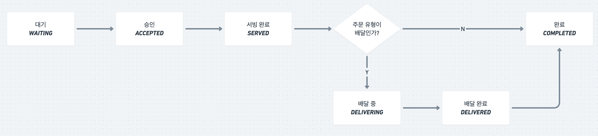

# 키친포스

## 퀵 스타트

```sh
cd docker
docker compose -p kitchenpos up -d
```

## 요구 사항

* 메뉴 그룹 (Menu Group)
  - 정의: 특정 목적에 맞는 메뉴의 집합
  - [ ] 메뉴 그룹은 항상 이름을 갖는다.
  - [ ] 단일 메뉴 그룹을 생성할 수 있다.
  - [ ] 단일 메뉴 그룹을 조회할 수 있어야 하는데 이건 왜 API가 없지?
  - [ ] 모든 메뉴 그룹을 조회할 수 있다.
* 메뉴 (Menu)
  - 정의: 특정 목적에 맞는 상품의 조합
    - 이때, 메뉴에 포함된 상품을 '메뉴 상품'이라 부른다.
  - [ ] 메뉴는 항상 이름, 가격, 조합된 메뉴 상품, 포함될 메뉴 그룹을 갖는다.
    - [ ] 메뉴 이름은 비속어를 포함하지 않아야 한다.
    - [ ] 메뉴 가격은 0과 조합된 상품 가격의 총합 사이의 값이어야 한다.
    - [ ] 메뉴는 적어도 하나의 메뉴 상품이 있어야 한다.
    - [ ] 각 메뉴 상품의 개수는 0보다 커야 한다.
  - [ ] 단일 메뉴를 생성할 수 있다.
  - [ ] 단일 메뉴의 가격을 수정할 수 있다.
    - [ ] 수정된 메뉴 가격은 0과 조합된 상품 가격의 총합 사이의 값이어야 한다.
  - [ ] 단일 메뉴의 노출 여부를 토글할 수 있다.
    - [ ] 노출된 메뉴 가격은 0과 조합된 상품 가격의 총합 사이의 값이어야 한다.
  - [ ] 단일 메뉴를 조회할 수 있다.
  - [ ] 모든 메뉴를 조회할 수 있다.
* 상품 (Product)
  - [ ] 상품은 항상 이름, 가격을 갖는다.
    - [ ] 상품 이름은 비속어를 포함하지 않아야 한다.
    - [ ] 상품 가격은 0 이상이어야 한다.
  - [ ] 단일 상품을 생성할 수 있다.
  - [ ] 단일 상품의 가격을 수정할 수 있다.
    - [ ] 이 상품을 메뉴 상품으로 사용하는 모든 메뉴의 가격을 수정된 상품 가격을 반영하여 검증해야 한다.
      - 메뉴 가격은 0과 조합된 상품 가격의 총합 사이의 값이어야 한다. 그렇지 않으면 노출 상태를 미노출로 변경한다.
  - [ ] 단일 상품을 조회할 수 있다.
* 주문 (Order)
  - 정의: 고객이 결제하려고 하는 메뉴의 조합
    - 이때, 주문에 포함된 메뉴를 '주문 항목'이라 부른다.
  - [ ] 주문은 항상 주문 유형, 주문 상태, 주문 항목, 주문 시각을 갖는다.
    - [ ] 주문 유형은 '배달', '포장', '매장 내 식사'가 있다.
    - [ ] 주문 상태는 '대기', '승인', '서빙 완료', '배달 중', '배달 완료', '완료'가 있다.
      
    - [ ] 주문은 적어도 하나의 주문 항목이 있어야 한다.
    - [ ] '매장 내 식사'인 경우 각 주문 항목의 개수가 음수일 수 있다(?).
    - [ ] '매장 내 식사'가 아닌 경우 각 주문 항목의 개수는 0 이상이어야 한다.
  - [ ] 고객이 메뉴를 주문할 수 있다.
    - [ ] 미노출 메뉴는 주문할 수 없다.
    - [ ] 고객이 주문한 항목의 가격과 실제 메뉴 가격은 같아야 한다.
    - [ ] 최초의 주문 상태는 '대기'이어야 한다.
    - [ ] 주문 유형이 '배달'이면 배달 주소가 있어야 한다.
    - [ ] 주문 유형이 '매장 내 식사'이면 점유 상태인 주문 테이블이 있어야 한다.
  - [ ] 단일 주문을 승인할 수 있다.
    - [ ] 주문 상태가 '대기'인 주문만 승인할 수 있다.
    - [ ] 주문 유형이 '배달'이면 라이더에게 배달을 요청해야 한다.
  - [ ] 단일 주문을 서빙할 수 있다.
    - [ ] 주문 상태가 '승인'인 주문만 서빙할 수 있다.
    - [ ] 서빙한 주문의 상태는 '서빙 완료'로 변경해야 한다.
  - [ ] 단일 주문을 배달할 수 있다.
    - [ ] 주문 유형이 '배달'인 주문만 배달할 수 있다.
    - [ ] 주문 상태가 '서빙 완료'인 주문만 배달할 수 있다.
    - [ ] 주문 상태를 '배달 중'으로 변경해야 한다.
  - [ ] 단일 주문 배달을 완료할 수 있다.
    - [ ] 주문 유형이 '배달'인 주문만 배달을 완료할 수 있다.
    - [ ] 주문 상태가 '배달 중'인 주문만 배달을 완료할 수 있다.
    - [ ] 주문 상태를 '배달 완료'로 변경해야 한다.
  - [ ] 단일 주문을 완료할 수 있다.
    - [ ] 주문 유형이 '배달'이고 주문 상태가 '배달 완료'이면 주문을 완료할 수 있다.
    - [ ] 주문 유형이 '배달'이 아니고 주문 상태가 '서빙 완료'이면 주문을 완료할 수 있다.
    - [ ] 주문 상태를 '완료'로 변경해야 한다.
    - [ ] 주문 유형이 '매장 내 식사'이면 주문 테이블의 점유를 해제해야 한다.
  - [ ] 모든 주문을 조회할 수 있다.
* 주문 테이블 (Order Table)
  - 정의: 고객이 매장에서 식사하기 위해 사용하는 테이블
  - [ ] 주문 테이블은 항상 이름, 고객의 수, 점유 상태를 갖는다.
    - [ ] 주문 테이블 이름이 빈 문자열일 수 없다.
  - [ ] 고객이 단일 주문 테이블에 앉을 수 있다.
    - [ ] 주문 테이블 점유 상태를 '사용 중'으로 변경해야 한다.
  - [ ] 단일 주문 테이블을 정리할 수 있다.
    - [ ] 주문 테이블 점유 상태를 '빈 자리'로 변경해야 한다.
    - [ ] 주문 테이블에 앉은 고객의 수를 0으로 변경해야 한다.
  - [ ] 단일 주문 테이블에 앉은 고객의 수를 변경할 수 있다.
    - [ ] '사용 중'인 주문 테이블에 앉은 고객의 수가 0 이상이어야 한다.
  - [ ] 모든 주문 테이블을 조회할 수 있다.

## 용어 사전

| 한글명 | 영문명 | 설명 |
|-----|-----|----|
|     |     |    |

## 모델링
