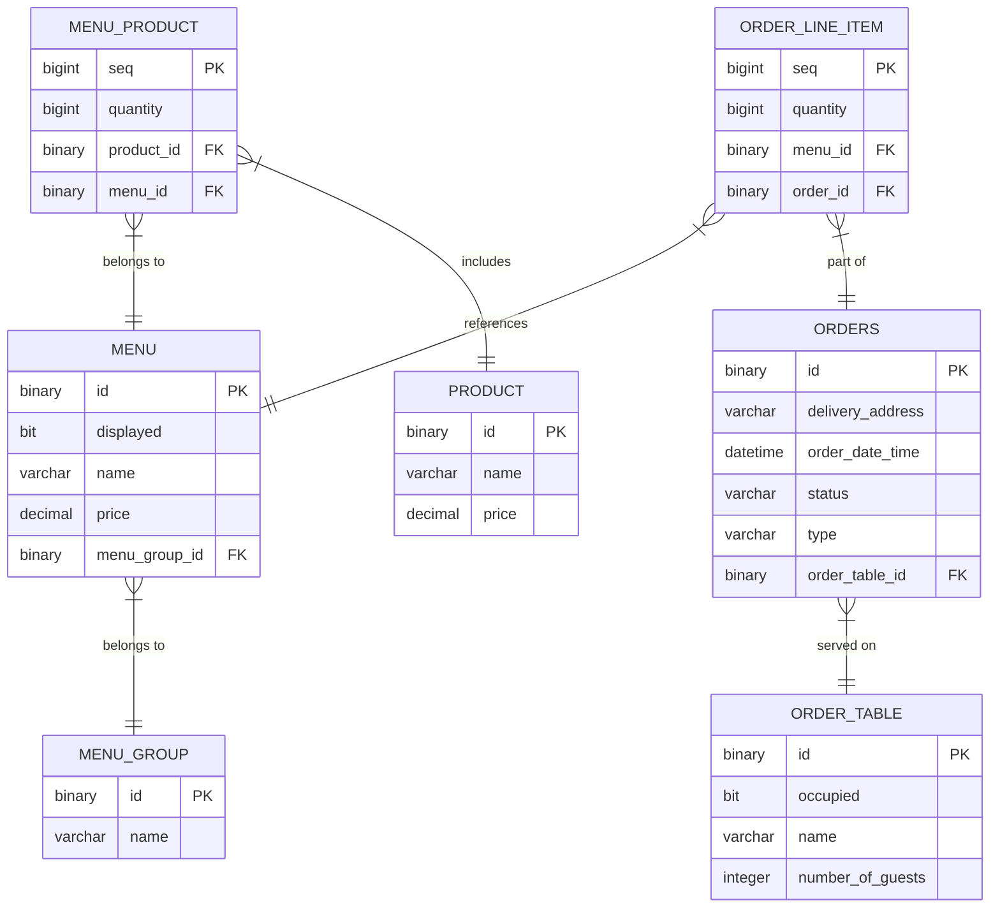

# 키친포스

## 퀵 스타트

```sh
cd docker
docker compose -p kitchenpos up -d
```
## 엔티티 관계

```mermaid
erDiagram
    MENU {
        binary id PK
        bit displayed 
        varchar name
        decimal price
        binary menu_group_id FK
    }

    MENU_GROUP {
        binary id PK
        varchar name
    }

    MENU_PRODUCT {
        bigint seq PK
        bigint quantity
        binary product_id FK
        binary menu_id FK
    }

    ORDER_LINE_ITEM {
        bigint seq PK
        bigint quantity
        binary menu_id FK
        binary order_id FK
    }

    ORDER_TABLE {
        binary id PK
        bit occupied 
        varchar name
        integer number_of_guests
    }

    ORDERS {
        binary id PK
        varchar delivery_address
        datetime order_date_time
        varchar status
        varchar type
        binary order_table_id FK
    }

    PRODUCT {
        binary id PK
        varchar name
        decimal price
    }

    MENU }|--|| MENU_GROUP: "belongs to"
    MENU_PRODUCT }|--|| MENU: "belongs to"
    MENU_PRODUCT }|--|| PRODUCT: "includes"
    ORDER_LINE_ITEM }|--|| MENU: "references"
    ORDER_LINE_ITEM }|--|| ORDERS: "part of"
    ORDERS }|--|| ORDER_TABLE: "served on"
```

## 요구 사항
메뉴
- [ ] 메뉴를 등록할 수 있다.
- [ ] 메뉴를 조회할 수 있다.
- [ ] 메뉴의 가격을 수정할 수 있다.
- [ ] 메뉴의 노출 여부를 변경할 수 있다.

메뉴 그룹
- [ ] 추천 메뉴 그룹을 등록할 수 있다.
- [ ] 메뉴 그룹을 조회할 수 있다.

상품
- [ ] 상품을 등록할 수 있다.
- [ ] 상품을 조회할 수 있다.
- [ ] 상품의 가격을 수정할 수 있다.

주문
- [ ] 주문을 등록할 수 있다.
- [ ] 주문의 상태를 변경시킬 수 있다.
- [ ] 주문을 조회할 수 있다.

주문 테이블
- [ ] 주문 테이블을 등록할 수 있다.
- [ ] 주문 테이블의 이용 여부를 수정할 수 있다.
- [ ] 주문 테이블의 이용 인원을 수정할 수 있다.
- [ ] 주문 테이블을 조회할 수 있다.

## 용어 사전

| 한글명 | 영문명 | 설명 |
| --- | --- | --- |
|  |  |  |

## 모델링
