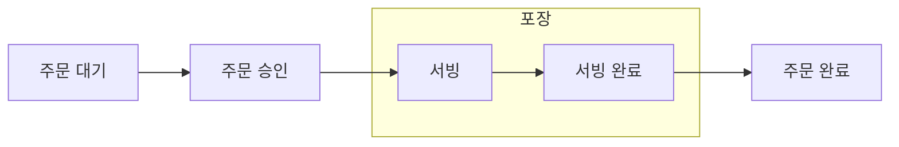
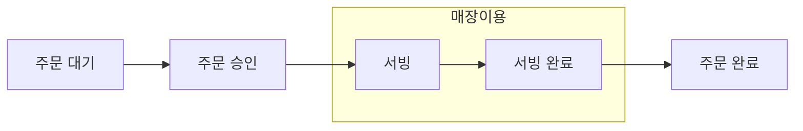
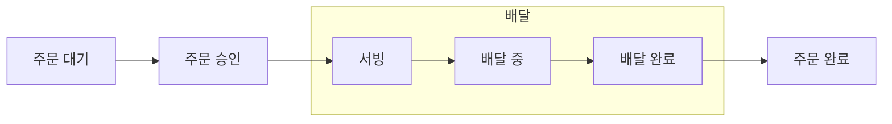
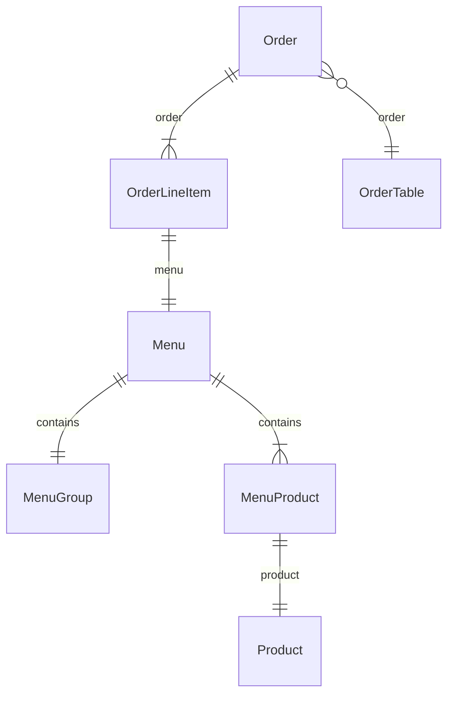

# 키친포스

## 퀵 스타트

```sh
cd docker
docker compose -p kitchenpos up -d
```

---

## 요구 사항
### 메뉴
- [ ] 메뉴는 메뉴명, 가격, 메뉴 그룹, 게시 여부, 메뉴 상품으로 구성됨
- [ ] 매뉴를 등록함
  - [ ] 하나의 메뉴에는 하나의 메뉴 그룹이 등록되어야 함
  - [ ] 하나의 메뉴에는 하나 이상의 여러 메뉴 상품이 등록되어야 함
- [ ] 메뉴명은 필수이며, 비속어가 포함될 수 없음
- [ ] 가격을 변경함
  - [ ] 가격은 0원 이상이어야 함
  - [ ] 가격이 메뉴 상품 가격의 총합보다 적은 경우에만 변경 가능함
- [ ] 메뉴의 게시/숨김 여부를 관리할 수 있음
  - [ ] 메뉴의 가격이 메뉴 상품 가격의 총합보다 큰 경우에만 변경 가능함
- [ ] 전체 메뉴를 조회할 수 있음

#### 메뉴 그룹
- [ ] 메뉴 그룹을 등록함
  - [ ] 메뉴 그룹명은 필수임
- [ ] 전체 메뉴 그룹을 조회함

### 상품
- [ ] 상품 가격은 0원 이상이어야 함
- [ ] 상품명은 필수이며, 비속어가 포함될 수 없음
- [ ] 상품 가격은 변경 가능하지만, 상품 가격 변경시에 메뉴의 가격이 메뉴에 속한 상품 금액의 합보다 크다면 메뉴를 숨긴다.
- [ ] 전체 상품을 조회함

### 주문
- [ ] 주문 타입은 배달(DELIVERY), 포장(TAKEOUT), 매장 이용(EAT_IN) 3가지로 구분됨
- [ ] 주문 상태는 대기(WAITING), 승인(ACCEPTED), 서빙(SERVED), 배달 중(DELIVERING), 배달 완료(DELIVERED), 주문 완료(COMPLETED)가 있음
- [ ] 숨김 처리된 메뉴는 주문할 수 없음
- [ ] 전체 주문을 조회함

#### 주문 테이블
- [ ] 주문 테이블을 생성함
  - [ ] 주문 테이블의 이름은 필수임
  - [ ] 주문 테이블 최초 생성 시, 손님 수는 0이며 빈 상태로 셋팅함
- [ ] 주문 테이블에 손님을 채움
- [ ] 주문 테이블을 치움
  - [ ] 주문 테이블이 존재하고 주문 완료 상태인 경우, 손님 수를 0으로 설정하고 테이블을 비움 
- [ ] 주문 테이블의 손님 수를 변경함
  - [ ] 손님 수가 1명 이상인 경우에만 변경 가능함
  - [ ] 주문 테이블이 빈 상태인 경우에만 변경 가능함
- [ ] 전체 주문 테이블을 조회함

#### 매장 이용 주문
- [ ] 빈 테이블에는 매장 주문을 등록할 수 없음
- [ ] 주문이 들어오면 주문 대기 상태가 되며 고객 수, 테이블 사용 여부에 맞춰 주문 테이블이 셋팅됨
- [ ] 주문 대기 건을 승인함 (단, 주문 대기 상태인 경우에만)
  - [ ] 주문 승인이 완료되면 주문 승인 상태로 변경함
- [ ] 음식을 서빙함 (단, 주문 승인 상태인 경우에만)
  - [ ] 음식 서빙이 완료되면 서빙 완료 상태로 변경함
- [ ] 서빙이 완료되면 주문 완료 처리함 (단, 서빙 완료 상태인 경우에만)
  - [ ] 해당 테이블의 모든 주문이 완료되면 해당 테이블을 비움

#### 포장 주문
- [ ] 주문이 들어오면 주문 대기 상태가 됨
- [ ] 주문서에 주문 수량은 1개 이상이어야 함
- [ ] 주문 대기 건을 승인함 (단, 주문 대기 상태인 경우에만)
    - [ ] 주문 승인이 완료되면 주문 승인 상태로 변경함
- [ ] 음식을 서빙함 (단, 주문 승인 상태인 경우에만)
    - [ ] 음식 서빙이 완료되면 서빙 완료 상태로 변경함
- [ ] 서빙이 완료되면 주문 완료 처리함 (단, 서빙 완료 상태인 경우에만)

#### 배달 주문
- [ ] 배달지가 없는 경우, 배달 주문을 받을 수 없음
- [ ] 주문서에 주문 수량은 1개 이상이어야 함
- [ ] 주문이 들어오면 주문 대기 상태가 되며 배달 주소가 셋팅됨
- [ ] 주문 승인을 승인할 수 있음 (단, 주문이 대기 상태인 경우에만)
  - [ ] 주문을 승인할 때, 배달 라이더에게 배달을 요청함
- [ ] 배달을 시작함 (단, 서빙 완료 상태가 아닌 경우에만)
    - [ ] 배달을 시작하면 배달 중 상태로 변경함
- [ ] 음식 배달이 완료되면 배달 완료 처리함 (단, 배달 중 상태인 경우에만)
  - [ ] 음식 배달이 완료되면 배달 완료 상태로 변경함 
- [ ] 배달이 완료되면 주문 완료 처리함 (단, 배달 완료 상태인 경우에만)

---

## 용어 사전
| 한글명    | 영문명          | 설명            |
|--------|--------------|---------------|
| 메뉴     | Menu         | 메뉴            |
| 메뉴 그룹  | Menu Group   | 메뉴가 포함된 그룹    |
| 메뉴 상품  | Menu Product | 메뉴에 포함된 상품    |
| 가격     | Price        | 메뉴의 가격        |
| 게시     | Display      | 메뉴 게시 여부 - 게시 |
| 숨김     | Hide         | 메뉴 게시 여부 - 숨김 |
| 비속어    | Profanity    | 비속어           |
| 상품     | Product      | 상품            |
| 주문     | Order        | 주문            |
| 주문서    | Order Line   | 주문서           |
| 주문 테이블 | Order Table  | 주문 테이블        |
| 손님 수   | NumberOfGuests | 손님의 인원 수      |
| 채움 여부  | Occupied    | 주문 테이블의 상태 (채움/비움) |
| 배달     | DELIVERY     | 주문 타입 - 배달    |
| 포장     | TAKEOUT      | 주문 타입 - 포장    |
| 매장 이용  | EAT_IN       | 주문 타입 - 매장 이용 |


---

## 모델링

### 주문 상태 (포장)

```mermaid
flowchart LR
  A[주문 대기] --> B[주문 승인]
  B[주문 승인] --> C[서빙]
  subgraph TakoutEatinDraw[포장]
    C[서빙] --> F[서빙 완료]
  end
  F[서빙 완료] --> G[주문 완료]
```

### 주문 상태 (매장 이용)

```mermaid
flowchart LR
  A[주문 대기] --> B[주문 승인]
  B[주문 승인] --> C[서빙]
  subgraph TakoutEatinDraw[매장이용]
    C[서빙] --> F[서빙 완료]
  end
  F[서빙 완료] --> G[주문 완료]
```

### 주문 상태 (배달)

```mermaid
flowchart LR
  A[주문 대기] --> B[주문 승인]
  B[주문 승인] --> C[서빙]
  subgraph DeliveryDraw[배달]
    C[서빙] --> D[배달 중]
    D[배달 중] --> E[배달 완료]
  end
  E[배달 완료] --> G[주문 완료]
```

### 치킨포스

```mermaid
erDiagram
  Order ||--|{ OrderLineItem : order
  Order o{--|| OrderTable : order
  OrderLineItem ||--|| Menu : menu
  Menu ||--|| MenuGroup : contains
  Menu ||--|{ MenuProduct : contains
  MenuProduct ||--|| Product : product
```
