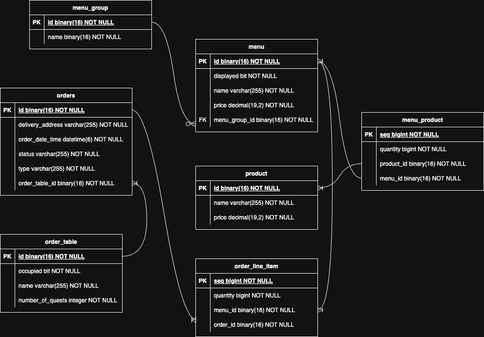

# 키친포스

## 퀵 스타트

****

```sh
cd docker
docker compose -p kitchenpos up -d
```

## 요구 사항

- 기존 레거시 키친포스를 리팩토링 한다.

****

### 1. 상품 (product)

1. 상품 조회
    - [x] 특정 조건 없이 상품의 모든 목록을 조회할 수 있다.
2. 상품 등록
    - [x] 상품명을 반드시 가지며 비속어를 포함하면 안된다.
    - [x] 상품가격은 0원 이상이어야 한다.
    - [x] 상품은 단건으로만 등록이 가능하다.
3. 상품 수정 (상품가격 수정)
    - [x] 상품가격이 0원 이상이어야 한다.
    - [x] 메뉴의 가격이 메뉴 구성 상품들의 총 금액보다 크면 해당 메뉴는 숨겨진다.

****

### 2. 메뉴 그룹 (menu group)

1. 메뉴 그룹 조회
    - [x] 특정 조건 없이 모든 목록을 조회할 수 있다.
2. 메뉴 그룹 등록
    - [x] 메뉴 그룹명을 반드시 가진다.

****

### 3. 메뉴 (menu)

- [x] 메뉴는 메뉴명, 메뉴가격, 노출여부, 메뉴 그룹의 정보를 반드시 가진다.

1. 메뉴 조회
    - [x] 특정 조건 없이 모든 목록을 조회할 수 있다.
2. 메뉴 등록
    - [x] 메뉴가격은 0원 이상이어야 한다.
    - [x] 메뉴 그룹에 속해 있어야 한다.
    - [x] 메뉴명도 상품명처럼 비속어를 포함하면 안된다.
    - [x] 등록 메뉴가격이 구성 상품의 총 금액보다 크지 않아야 한다.
    - [x] 메뉴 상품 정보를 반드시 가진다.
    - [x] 메뉴 상품 정보에 속한 상품의 수량은 0개 이상이어야 한다.
3. 메뉴 노출
    - [x] 메뉴가격이 구성 상품 총 금액보다 크지 않아야 한다.
4. 메뉴 숨김
    - [x] 등록 메뉴를 숨긴다.
5. 메뉴 가격 변경
    - [x] 변경가격이 0원 보다 작으면 안된다.
    - [x] 변경가격이 메뉴 구성 상품 총 금액보다 크지 않아야 한다.

****

### 4. 주문 (orders)

- [x] 주문상태, 주문유형, 주문시간을 반드시 가진다.

1. 주문 조회
    - [x] 특정 조건 없이 모든 목록을 조회할 수 있다.
2. 주문 등록
    - [x] 배달, 먹고가기, 포장(주문 유형)이 반드시 있어야 한다.
    - [x] 주문 아이템이 반드시 있어야 한다.
    - [x] 주문 아이템의 수량은 0개 이상이어야 한다.
    - [x] 주문 아이템의 메뉴는 반드시 있어야 한다.
    - [x] 배달, 포장 주문시 수량이 0원 이상이어야 한다.
    - [x] 메뉴가 노출된 상태여야 한다.
    - [x] 메뉴가격과 주문 아이템 가격이 다르면 안된다.
    - [x] 배달 주문시 배달 주소가 반드시 있어야 한다.
    - [x] 먹고가기(주문유형)의 경우 주문 테이블내역이 있어야 한다.
3. 주문 수락
    - [x] 현 주문상태가 **대기**이어야 한다.
    - [x] 배달 주문인 경우, 라이더에게 주문번호, 주문 아이템의 총 금액, 배달 주소를 전달해 배달 요청한다.
4. 서빙/준비 완료
    - [x] 현 주문상태가 **수락**이어야 한다.
5. 배달 시작
    - [x] 주문 유형이 **배달**이어야 한다.
    - [x] 현 주문상태가 **서빙/준비 완료**이어야 한다.
6. 배달 완료
    - [x] 현 주문상태가 **배달중**이어야 한다.
7. 주문 완료
    - [x] 배달(주문유형)인데 배달완료(주문상태)가 아니면 안된다.
    - [x] 포장, 먹고가기(주문유형)일 경우 서빙완료(주문상태)이어야 한다.
    - [x] 먹고가기(주문유형)일 경우, 해당 주문을 완료 처리 하고 해당 테이블에 다른 진행 중인 주문이 없다면 테이블을 비우고 인원 수를 0명으로 설정한다.

****

### 5. 주문 테이블 (order table)

- [x] 주문 테이블은 테이블번호, 인원 수, 사용여부 값을 반드시 가진다.

1. 주문 테이블 조회
    - [x] 특정 조건 없이 모든 목록을 조회할 수 있다.
2. 주문 테이블 등록
    - [x] 테이블명은 공란일 수 없다.
3. 테이블 착석
    - [x] 테이블 사용중 처리한다.
4. 테이블 정리
    - [x] 주문 테이블이 있으면 주문상태가 **완료**이어야 한다.
    - [x] 빈 테이블로 설정한다.
5. 테이블 인원 변경
    - [x] 테이블 사용중인 상태여야 한다.
    - [x] 테이블 인원 수는 0명 이상이어야 한다.

****

## 용어 사전

### 주문 유형 (order type)

| 한글명  | 영문명      | 설명                  |
|------|----------|---------------------|
| 배달   | DELIVERY | 배달로 주문할 경우          |
| 포장   | TAKEOUT  | 포장으로 주문할 경우         |
| 먹고가기 | EAT_IN   | 먹고가기(주문 테이블) 주문할 경우 |

### 주문 상태 (order status)

| 한글명   | 영문명        | 설명                     |
|-------|------------|------------------------|
| 대기    | WAITING    | 주문 요청상태 (주문 등록 후 대기상태) |
| 수락    | ACCEPTED   | 주문 요청 후 수락상태           |
| 서빙/제공 | SERVED     | 주문 수락 후 서빙/제공완료 상태     |
| 배달    | DELIVERING | 서빙/제공완료 후 배달중 상태       |
| 배달완료  | DELIVERED  | 배달중 이후 배달완료 상태         |
| 주문완료  | COMPLETED  | 주문 완료 상태               |

****

## 모델링


