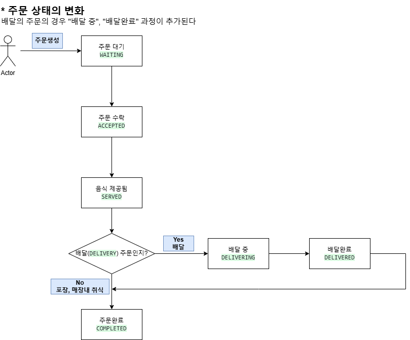

# 키친포스

## 퀵 스타트

```sh
cd docker
docker compose -p kitchenpos up -d
```

## 요구 사항
음식점의 주문 시스템을 구현한다.

### 상품(product)
**상품이란?**
> 햄버거, 감자튀김, 치킨과 같은 각각의 개별적인 음식을 상품이라고 부른다.
- [ ] 상품을 등록할 수 있다
  - [ ] 상품명과 가격을 입력할 수 있다
  - [ ] 상품명과 가격은 반드시 입력되어야 한다
  - [ ] 상품명은 비속어가 있으면 등록할 수 없다
  - [ ] 가격은 0원 이상이어야 한다
- [ ] 상품 가격을 수정할 수 있다
  - [ ] 상품 가격은 0원 이상이어야 한다
  - [ ] 메뉴의 가격이 메뉴에 속한 상품들의 가격 총 합보다 클 경우, 그 메뉴는 유효하지 않다.
  - [ ] 유효하지 않은 메뉴는 노출하지 않는다
- [ ] 모든 상품을 조회할 수 있다

### 메뉴(menu)
**메뉴란?**
```
단일 상품 또는 여러 상품들을 조합하여 메뉴로 구성할 수 있다

- 단일 상품을 메뉴로 만들 수 있다
ex) 햄버거, 치킨

- 단일 상품을 여러개 조합하여 세트 메뉴를 만들 수 있다
ex) 햄버거 세트(햄버거 + 감자튀김 + 음료)

- 상품을 판매하기 위해서는 상품을 메뉴로 등록해야 한다
```
**메뉴판이란?**
```
메뉴를 판매하기 위해서는 메뉴판에 메뉴를 전시해야 한다
메뉴판의 구성은 메뉴 그룹(햄버거, 세트 등) 밑에 메뉴를 전시한다 
ex) 
햄버거          세트              음료         사이드
  > 치킨버거      > 치킨버거세트      > 콜라      > 감자튀김  
  > 새우버거      > 새우버거세트      > 사이다    > 치즈스틱
```
- [ ] 메뉴를 등록할 수 있다
  - [ ] 단일 또는 여러 상품을 조합하여 메뉴를 만들 수 있다
  - [ ] 각 메뉴를 구성하는 상품과 그 수량을 선택할 수 있다
    - [ ] 각 메뉴를 구성하는 상품의 수량은 0이상이어야 한다
  - [ ] 메뉴는 메뉴명, 가격, 메뉴판 전시 여부(전시 O/ 전시 X) 정보를 가진다
  - [ ] 메뉴명, 가격, 메뉴판 전시 여부는 반드시 입력되어야 한다
  - [ ] 메뉴명에 비속어가 있으면 입력할 수 없다
  - [ ] 메뉴의 가격은 0원 이상이어야 한다
  - [ ] 메뉴의 가격이 포함된 상품 가격 총합과 동일하거나 할인된 가격일 경우만 등록 가능하다
  - [ ] 메뉴는 하나의 메뉴그룹을 가진다

- [ ] 메뉴는 가격을 수정할 수 있다
  - [ ] 메뉴의 가격이 0원 이상이어야 한다
  - [ ] 메뉴의 가격은 포함된 상품 가격 총합과 동일하거나 할인된 가격으로만 수정할 수 있다

- [ ] 메뉴판에 메뉴를 전시한다
  - [ ] 메뉴판 전시 여부를 O로 변경한다
  - [ ] 메뉴의 가격이 포함된 상품 가격 총합과 동일하거나 할인된 가격인 경우만 전시할 수 있다

- [ ] 메뉴판에서 메뉴를 내린다
  - [ ] 메뉴판 전시 여부를 X로 변경한다
- [ ] 모든 메뉴를 조회할 수 있다    

### 메뉴 그룹(menu_group)
- [ ] 메뉴판의 메뉴그룹명을 등록할 수 있다
  - [ ] 메뉴그룹명은 반드시 입력되어야 한다
  - [ ] 메뉴그룹명은 공백만 입력되어서는 안된다
- [ ] 모든 메뉴 그룹을 조회할 수 있다

### 주문(Order)
**주문이란?**
> 고객은 메뉴를 구매하기 위해서 주문을 해야 한다
> 주문의 종류는 매장 내 취식, 포장, 배달을 선택할 수 있다

### 주문 테이블(order_table)
**주문 테이블이란?**
```
- 매장 내 취식(EAT_IN)하는 고객의 경우, 테이블이 배정되어야 한다
- 테이블 내에서 주문 내역을 기반으로 주문이 이루어진다
```
- [ ] 주문 테이블을 등록할 수 있다
  - [ ] 테이블에 이름을 지정할 수 있다
  - [ ] 테이블 이름은 반드시 입력되어야 한다
  - [ ] 테이블 이름은 공백만 입력되어서는 안된다
  - [ ] 테이블에 있는 고객의 수를 확인할 수 있다
    - [ ] 테이블 최초 등록 시에는 고객의 수를 0명으로 등록한다
  - [ ] 테이블 사용 유무(사용 중/사용 안함)을 알 수 있다
    - [ ] 테이블 최초 등록 시에는 테이블 사용 안함으로 등록한다

- [ ] 주문 테이블에 고객이 배정된다
  - [ ] 테이블의 사용 유무를 사용 중으로 변경한다

- [ ] 주문 테이블을 정리한다
  - [ ] 주문 상태가 완료가 아니면 정리할 수 없다
  - [ ] 고객의 수 0명, 테이블 사용유무 사용안함으로 변경한다
- [ ] 테이블에 앉아있는 고객의 수를 변경할 수 있다
  - [ ] 고객의 수를 0 미만으로는 변경할 수 없다
  - [ ] 테이블의 사용유무가 사용안함이면 안된다
- [ ] 모든 주문 테이블을 조회할 수 있다

### 주문(orders)
주문의 종류에 따른 주문 상태의 변화는 아래 도식도를 참고하도록 한다


- [ ] 주문은 생성할 수 있다
  - [ ] 주문의 종류는 배달(DELIVERY), 포장(TAKEOUT), 매장 내 취식(EAT_IN) 중 선택할 수 있다
  - [ ] 어떤 메뉴를 몇 개 시킬지에 대한 주문 상세 내역이 1개 이상 있어야 한다
  - [ ] 배달, 포장의 경우, 주문한 메뉴의 수량이 0이상이어야 한다
  - [ ] 메뉴판에 전시되지 않은 메뉴는 주문할 수 없다
  - [ ] 메뉴의 가격과 주문 내역의 가격은 동일해야 한다 
  - [ ] 배달의 경우, 배달 주소가 반드시 입력되어야 한다
    - [ ] 배달 주소는 공백만 입력되어서는 안된다
  - [ ] 매장 내 취식의 경우, 매장 내 배정된 주문 테이블이 있어야 한다
    - [ ] 주문 테이블의 사융 유무가 사용 중이어야 한다
  - [ ] 주문의 상태는 '대기(WAITING)'가 된다
- [ ] 대기하고 있는 주문을 수락한다
  - [ ] 주문의 상태가 대기(WAITING)일 때 주문 수락이 가능하다
  - [ ] 배달 주문의 경우, 라이더에게 주문 정보(주문 총액, 배달 주소)를 제공하여 배달하도록 한다
  - [ ] 주문의 상태를 주문 수락(ACCEPTED)으로 변경한다
- [ ] 수락한 주문을 기반으로 음식을 제공한다
  - [ ] 수락한 주문의 상태는 주문 수락(ACCEPTED)이어야 한다
  - [ ] 음식 제공 후, 주문 상태를 음식 제공됨(SERVED)으로 변경한다
- [ ] 배달 주문의 경우, 배달을 시작한다
  - [ ] 주문의 상태가 음식 제공됨(SERVED)일 때 배달 가능하다
  - [ ] 주문의 상태를 배달 중(DELIVERING)으로 변경한다
- [ ] 배달 주문의 경우, 배달이 완료한다
  - [ ] 주문의 상태가 배달 중(DELIVERING)인 경우만 배달 완료할 수 있다
  - [ ] 주문 상태를 배달 완료(DELIVERED)으로 변경한다
- [ ] 주문을 완료한다
  - [ ] 주문 유형에 따라 아래와 같은 주문 상태일 때만 완료할 수 있다
    - [ ] 배달은 주문 상태가 배달 완료(DELIVERED)여야 한다
    - [ ] 매장 내 취식/포장은 주문 상태가 음식 제공됨(SERVED)이어야 한다
  - [ ] 매장 내 취식의 경우, 해당 테이블에 미완료된 주문이 없다면 테이블을 정리한다
    - [ ] 고객의 수를 0명으로 변경한다
    - [ ] 주문 테이블의 사용유무가 사용안함으로 변경한다
  - [ ] 주문의 상태를 주문완료(COMPLETED)로 변경한다
- [ ] 모든 주문 목록을 조회할 수 있다

## 용어 사전

| 한글명 | 영문명 | 설명 |
| --- | --- | --- |
|  |  |  |

## 모델링
