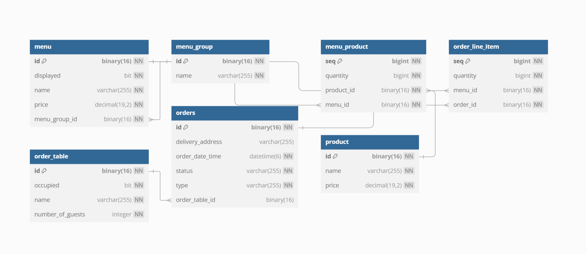

# 키친포스

## 퀵 스타트

```sh
cd docker
docker compose -p kitchenpos up -d
```

## 요구 사항

- 가게에서 상품과 메뉴를 등록하고 이를 주문하는 키친 포스 시스템을 구현합니다.

    1. 상품
        1) 상품을 등록할 수 있다.
            - 상품가격은 0원 이상이어야 한다.
            - 상품명은 외부 검증을 통해 욕설이나 외설성이 있으면 안된다.
            - 상품명은 1글자 이상이어야 한다.
        2) 상품의 가격은 변경이 가능하다.
            - 상품가격은 0원 이상이어야 한다.
            - 상품은 주인이 등록한 상품만 수정 가능하다.
            - 메뉴에 있는 상품들의 가격의 총합이 메뉴의 전체 가격보다 낮으면 메뉴를 노출하지 않는다.
                - 메뉴에 있는 상품 A의 가격이 5000원, 상품 B의 가격이 6000원이라면 메뉴의 전체 가격은 11000원 보다 초과하면 더 이상 메뉴를 노출하지 않는다.
        3) 모든 상품을 조회할 수 있다.
            - 등록된 메뉴가 하나도 없다면 조회했을 때 아무 것도 뜨지 않는다.

    2. 메뉴 모음
        1) 메뉴 모음을 등록할 수 있다.
            - 메뉴 모음의 이름은 1글자 이상이어야 한다.
        2) 모든 메뉴 모음을 조회할 수 있다.
            - 등록된 메뉴 모음이 하나도 없다면 조회했을 때 아무 것도 뜨지 않는다.

    3. 메뉴
        1) 메뉴를 등록할 수 있다.
            - 메뉴의 가격은 0원 이상이어야 한다.
            - 메뉴 모음은 하나 이상의 메뉴로 구성되어야 한다.
            - 메뉴는 하나 이상의 상품으로 구성되어 있다.
            - 메뉴에 등록된 모든 상품은 이미 등록이 된 상품이어야 한다.
            - 메뉴를 구성하는 상품과 수량은 등록할 수 있다.
            - 메뉴의 전체 가격이 메뉴의 상품들의 전체 가격보다 크면 안된다.
                - 메뉴에 있는 상품 A의 가격이 5000원, 상품 B의 가격이 6000원이라면 메뉴의 전체 가격은 11000원 보다 초과하면 안된다.
            - 메뉴명은 1글자 이상이어야 한다.
        2) 메뉴의 가격은 변경이 가능하다.
            - 메뉴의 가격은 0원 이상이어야 한다.
            - 주인이 등록한 메뉴의 가격만 수정이 가능하다.
            - 메뉴에 등록된 상품들의 전체가격은 변경된 메뉴의 가격보다 크면 안된다.
                - 메뉴에 있는 상품 A의 가격이 5000원, 상품 B의 가격이 6000원이라면 메뉴의 전체 가격을 11000보다 적게 하면 안된다.
        3) 메뉴를 노출할 수 있다.
            - 주인이 등록한 메뉴만 노출할 수 있다.
            - 메뉴 상품들의 가격 합보다 메뉴 가격이 크면 메뉴를 노출할 수 없다.
                - 메뉴에 있는 상품 A의 가격이 5000원, 상품 B의 가격이 6000원이라면 메뉴의 전체 가격이 11000보다 적으면 메뉴를 노출할 수 없다.
        4) 메뉴를 노출하지 않을 수 있다.
            - 주인이 등록한 메뉴만 노출하지 않을 수 있다.
        5) 모든 메뉴를 조회할 수 있다.
            - 등록된 메뉴가 하나도 없다면 조회했을 때 아무 것도 뜨지 않는다.

    4. 주문
        1) 매장 주문일 때
            1. 주문을 등록할 수 있다.
                - 주문 유형은 배달, 테이크아웃, 매장으로 세가지가 존재한다.
                - 주문에는 구체적인 주문 항목들이 존재해야 한다.
                - 주문 항목들에 있는 메뉴는 등록된 메뉴여야 한다.
                - 메뉴의 전체 가격은 주문 항목들의 가격의 합과 같아야 한다.
                    - 1000원 짜리 상품 A를 2개, 2000원 짜리 상품 B로 구성된 메뉴를 주문했다면 가격은 4000원이어야 한다.
                - 주문이 들어오면 주문은 대기상태이다.
                - 주문 시간은 주문이 들어온 현재시간으로 한다.
                - 매장에 사용 가능한 주문 테이블이 존재해야 한다.
            2. 주문이 들어오면 주문을 수락할 수 있다.
                - 주문이 들어와야 주문을 수락할 수 있다.
                - 대기 상태인 주문만 수락이 가능하다.
            3. 주문을 들어왔다면 메뉴를 준비한다.
                - 주문이 들어와야 메뉴 준비가 가능하다.
                - 주문이 수락됐다면 메뉴 준비 중으로 주문 상태가 변경된다.
            4. 메뉴 준비가 끝나면 주문을 완료할 수 있다.
                - 메뉴 준비가 끝났을 때 주문을 완료하고 주문 테이블이 사용 중이라면 테이블의 사용 인원을 0명으로 초기화하고 테이블을 사용 가능하도록 등록한다.
            5. 모든 주문을 조회할 수 있다.
                - 등록된 주문이 하나도 없다면 조회했을 때 아무 것도 뜨지 않는다.
        2) 테이크 아웃 주문일 때
            1. 주문을 등록할 수 있다.
                - 주문 유형은 배달, 테이크아웃, 매장으로 세가지가 존재한다.
                - 주문에는 구체적인 주문 항목들이 존재해야 한다.
                - 주문 항목들에 있는 메뉴는 등록된 메뉴여야 한다.
                - 메뉴의 전체 가격은 주문 항목들의 가격의 합과 같아야 한다.
                    - 1000원 짜리 상품 A를 2개, 2000원 짜리 상품 B로 구성된 메뉴를 주문했다면 가격은 4000원이어야 한다.
                - 주문이 들어오면 주문은 대기상태이다.
                - 주문 항목이 없으면 안된다.
            2. 주문이 들어오면 주문을 수락할 수 있다.
                - 주문이 들어와야 주문을 수락할 수 있다.
                - 대기 상태인 주문만 수락이 가능하다.
            3. 주문을 들어왔다면 메뉴를 준비한다.
                - 주문이 들어와야 메뉴 준비가 가능하다.
                - 주문이 수락됐다면 메뉴 준비 중으로 주문 상태가 변경된다.
            4. 메뉴 준비가 끝나면 주문을 완료할 수 있다.
                - 메뉴 준비가 끝났을 때 주문을 완료한다.
            5. 모든 주문을 조회할 수 있다.
                - 등록된 주문이 하나도 없다면 조회했을 때 아무 것도 뜨지 않는다.
        3) 배달 주문일 때
            1. 주문을 등록할 수 있다.
                - 주문 유형은 배달, 테이크아웃, 매장으로 세가지가 존재한다.
                - 주문에는 구체적인 주문 항목들이 존재해야 한다.
                - 주문 항목들에 있는 메뉴는 등록된 메뉴여야 한다.
                - 메뉴의 전체 가격은 주문 항목들의 가격의 합과 같아야 한다.
                    - 1000원 짜리 상품 A를 2개, 2000원 짜리 상품 B로 구성된 메뉴를 주문했다면 가격은 4000원이어야 한다.
                - 주문이 들어오면 주문은 대기상태이다.
                - 주문 항목이 없으면 안된다.
                - 배달 주소가 없으면 배달을 할 수 없다.
            2. 주문이 들어오면 주문을 수락할 수 있다.
                - 주문이 들어와야 주문을 수락할 수 있다.
                - 대기 상태인 주문만 수락이 가능하다.
                - 배달 기사에게 배달을 요청하려면 배달 주소와 주문 항목들의 총 가격 등의 주문 정보가 필요하다.
                - 배달 요청에 성공하면 주문 상태는 수락으로 변경된다.
            3. 주문을 들어왔다면 메뉴를 준비한다.
                - 주문이 들어와야 메뉴 준비가 가능하다.
                - 주문이 수락됐다면 메뉴 준비 중으로 주문 상태가 변경된다.
            4. 메뉴 준비가 끝나면 배달을 시작한다.
                - 메뉴 준비가 끝나면 배달 중으로 주문 상태가 변경된다.
            5. 배달 기사가 주문한 주소로 도착하면 배달이 완료된다.
                - 배달 중에 배달이 완료됐다면 배달 완료됨으로 주문 상태가 변경된다.
            6. 배달이 완료 됐다면 주문을 완료할 수 있다.
                - 배달이 완료되면 주문을 완료한다.
            7. 모든 주문을 조회할 수 있다.
                - 등록된 주문이 하나도 없다면 조회했을 때 아무 것도 뜨지 않는다.

    5. 주문 테이블
        1) 주문 테이블 등록
            - 주문 테이블명은 1글자 이상이어야 한다.
            - 주문 테이블의 인원은 0명으로 등록한다.
            - 주문 테이블의 상태는 사용가능으로 등록한다.
            - 위 상태를 모두 만족한다면 이에 맞는 `주문 테이블 id`를 생성하고 `주문 테이블`에 등록한다.
        2) 주문 테이블 착석
            - 주문 테이블 정보는 등록된 주문 테이블 정보여야한다.
            - 주문 테이블의 상태를 사용중으로 등록한다.
        3) 주문 테이블 청소
            - 주문 테이블 정보는 등록된 주문 테이블 정보여야한다.
            - 주문 테이블 상태가 전부 제공완료라면 주문 테이블의 인원을 0으로 변경하고 사용가능 상태로 변경한다.
        4) 주문 테이블 인원 변경
            - 주문 테이블 인원은 0명보다 많아야 한다.
            - 주문 테이블 정보는 등록된 주문 테이블 정보여야한다.
            - 주문 테이블 상태는 사용중여야 한다.
            - 주문 테이블 인원 정보를 변경한다.
        5) 주문 테이블 조회

## 모델링

