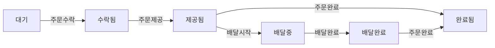

# 키친포스

## 퀵 스타트

```sh
cd docker
docker compose -p kitchenpos up -d
```

## 요구 사항

### step2. 키친포스

#### Product : 상품 관리

> **상품이란?**  
> 아메리카노, 참치 샌드위치, 팥 붕어빵 과 같은 개별 상품을 의미합니다.  
> 상품을 판매하기 위해서는 메뉴와 메뉴판을 구성해야 합니다.  (하단 메뉴 관리, 메뉴판 관리 항목을 참고해주세요.)

* 상품 등록하기
  * 이름과 가격을 입력할 수 있다
  * 이름에는 비속어와 같이 부적절한 단어는 사용할 수 없다
  * 이름은 null이 아닌 값이어야 한다
  * 상품의 가격은 0원을 초과해야 한다
* 상품 가격 변경하기
  * 상품의 가격은 0원을 초과해야 한다
  * 상품의 총합이 메뉴의 가격보다 크다면 유효하지 않은 메뉴가 된다
  * 유효하지 않은 메뉴는 노출하지 않는다 (내린다)
* 상품 조회하기
  * 모든 상품을 조회할 수 있다

#### Menu : 메뉴 관리

> **메뉴란?**  
> 아메리카노 1잔과 참치 샌드위치 1개 를  묶어 “참치모닝 1번 세트” 라는 메뉴로  구성할 수 있습니다.  
> 물론, 아메라카노 1잔만 메뉴로 등록이 가능합니다  
> 상품을 판매하기 위해서는 메뉴로 등록을 해야 합니다  
> 메뉴는 포함된 상품 가격의 총합보다 할인된 가격으로 팔 수 있습니다. 하지만, 더 비싼 가격으로 팔 수는 없습니다.

* 메뉴 등록하기
  * 이름과 가격을 입력할 수 있다
  * 이름에는 비속어와 같이 부적절한 단어는 사용할 수 없다
  * 이름은 null이 아닌 값이어야 한다
  * 1개 이상의 상품을 등록해야 한다
  * 상품은 개수와 같이 등록한다
  * 메뉴의 가격은 0원을 초과해야 한다
  * 메뉴의 가격은 등록된 상품의 총합보다 높을 수 없다
  * 메뉴는 하나 이상의 메뉴판에 속한다
  * (여러 종류의 메뉴판에서 같은 메뉴를 재사용하여 같은 메뉴에 대한 동일한 가격을 보장한다)
  * 메뉴 등록할때 전시를 할지 말지를 정할 수 있다
* 메뉴 가격 변경하기
  * 메뉴의 가격은 0원을 초과해야 한다
  * 메뉴의 가격은 등록된 상품의 총합보다 높을 수 없다
* 메뉴 전시하기
  * 메뉴를 전시할 수 있다
  * 전시될 메뉴의 가격은 등록된 상품의 총합보다 높을 수 없다
  * 메뉴를 전시하면 메뉴판에 메뉴가 보이게 된다
* 메뉴 내리기
  * 메뉴를 내릴 수 있다
  * 메뉴를 내리면 메뉴판에서 보이지 않는다
* 메뉴 조회하기
  * 모든 메뉴를 조회할 수 있다

#### MenuGroup : 메뉴판 관리

> **메뉴판이란?**  
> 메뉴판에는 다양한 메뉴를 담을 수 있니다  
> 다양한 환경에 제공될 여러 메뉴판을 만들 수 있습니다

* 메뉴판 등록하기
  * 이름을 등록할 수 있다
  * 이름은 null이 아닌 값이어야 한다
* 메뉴판 조회하기
  * 모든 메뉴판을 조회할 수 있다

#### Order : 주문 관리

> **주문이란?**  
> 고객은 메뉴를 구매하기 위해 주문을 합니다.  
> 주문 유형으로는 매장 식사, 포장, 배달을 선택할 수 있습니다.

** 주문 상태 흐름도 **
- 주문 상태를 변화를 이해하기 위한 흐름도 입니다.
- 주문 생성을 하면 최초 상태는 대기 상태가 됩니다.


```mermaid
graph LR
    A[대기] --주문수락--> B[수락됨];
    B --주문제공--> C[제공됨];
    C --배달시작--> D[배달중];
    D --배달완료--> E[배달완료];
    C --주문완료--> F[완료됨];
    E --주문완료--> F;
``` 

* 주문 생성하기
  * 주문 유형은 매장 식사, 포장, 배달 중 하나로 지정해야 한다.
  * 주문 항목은 1개 이상 포함되어야 한다.
  * 배달, 포장 주문인 경우 주문한 메뉴의 수량이 음수가 아니어야 한다.
  * 주문 항목에 포함된 메뉴는 반드시 전시 중 상태여야 한다.
  * 주문 항목의 가격은 메뉴에 설정된 가격과 동일해야 한다.
  * 매장 식사 주문의 경우, 테이블이 사용 중 상태여야 하며, 주문 테이블을 반드시 지정해야 한다.
  * 배달 주문의 경우, 배송 주소를 필수로 입력해야 한다
  * 주문 상태는 “대기” 상태가 된다
* 주문 수락하기
  * 주문 상태가 "대기" 상태인 경우에만 수락할 수 있다.
  * 배달 주문의 경우, 배달업체에 총 주문 금액과 배송 주소를 포함하여 배달 요청을 한다.
* 주문 제공하기
  * 주문 상태가 "수락됨" 상태인 경우에만 제공할 수 있다.
  * 주문 상태가 “제공됨” 상태가 된다
* 배달 시작하기
  * 주문 유형이 배달이고, 주문 상태가 "제공됨" 상태인 경우에만 배달을 시작할 수 있다.
  * 배달 시작 시 주문 상태를 "배달 중"으로 변경한다.
* 배달 완료하기
  * 주문 상태가 "배달 중" 상태인 경우에만 배달을 완료할 수 있다.
  * 배달 완료 시 주문 상태를 "배달 완료"로 변경한다.
* 주문 완료하기
  * 주문 유형에 따라 다음 상태인 경우에만 완료할 수 있다:
  * 배달: 주문 상태가 "배달 완료"인 경우.
  * 매장 식사 또는 포장: 주문 상태가 "제공됨"인 경우.
  * 매장 식사 주문 완료 시, 해당 테이블에 미완료된 주문이 없다면 테이블 상태를 초기화(미사용 상태 및 손님 수 0)한다.
* 주문 목록 조회하기
  * 모든 주문을 조회할 수 있다

#### OrderTable : 주문 테이블 관리

> **주문 테이블이란?**  
> 매작식사를 하는 손님은 테이블에 배정되어야 합니다.
> 계산은 테이블에서 주문한 내역으로 이루어 집니다.

* 주문 테이블 등록하기
  * 주문 테이블의 이름을 입력할 수 있다
  * 이름은 null이 아닌 값이어야 한다
  * 처음 등록시 해당 테이블은 비어있는 좌석으로 등록한다
* 테이블에 손님 배정하기
  * 손님이 테이블에 앉으면 해당 테이블은 사용중 상태가 된다
* 테이블에 손님 수 변경하기
  * 테이블이 사용중이라면 앉은 손님의 수를 변경할 수 있다
  * 손님의 수는 0명 이상 입력해야 한다.
* 테이블 정리하기
  * 주문이 끝난 테이블은 초기화 한다
  * (미사용 상태로 변경하고, 앉은 손님의 수를 0으로 초기화한다)
* 주문 테이블 조회하기
  * 모든 주문 테이블을 조회할 수 있다

### step1. 문자열 덧셈 계산기

* 쉼표(,) 또는 콜론(:)을 구분자로 가지는 문자열을 전달하는 경우 구분자를 기준으로 분리한 각 숫자의 합을 반환 (예: “” => 0, "1,2" => 3, "1,2,3" => 6, “1,2:3” => 6)
* 앞의 기본 구분자(쉼표, 콜론) 외에 커스텀 구분자를 지정할 수 있다. 커스텀 구분자는 문자열 앞부분의 “//”와 “\n” 사이에 위치하는 문자를 커스텀 구분자로 사용한다. 예를 들어 “//;\n1;2;3”과 같이 값을 입력할 경우 커스텀 구분자는 세미콜론(;)이며, 결과 값은 6이 반환되어야 한다.
* 문자열 계산기에 숫자 이외의 값 또는 음수를 전달하는 경우 RuntimeException 예외를 throw 한다.
* 요구 사항 보충
  * 커스텀 구분자를 정의해도 기본 구분자(쉼표, 콜론)는 유효하다.
  * 문자열에 공백(empty string)이나 null이 들어오면 0이 반환된다. (공백이 여러개인 문자열이 입력되면 RuntimeException 예외를 throw 한다.)

### step0. JUnit 5 학습

* racingcar 패키지의 Car에 대한 테스트 코드를 작성하며 JUnit 5에 대해 학습한다.
  * 자동차 이름은 5 글자를 넘을 수 없다.
  * 5 글자가 넘는 경우, IllegalArgumentException이 발생한다.
  * 자동차가 움직이는 조건은 0에서 9 사이의 무작위 값을 구한 후, 무작위 값이 4 이상인 경우이다.
* JUnit 5의 @DisplayName을 사용하여 테스트 메서드의 의도를 한글로 표현한다.
* JUnit의 Assertions이 아닌 AssertJ의 Assertions를 사용한다.
* 개발자는 코드를 작성하면서 확장성(scalability)에 대한 고민을 항상 해야 한다. 자동차가 다양한 방법으로 움직일 수 있게 구현한다.
* 자동차가 조건에 따라 움직였는지 움직이지 않았는지 테스트하고자 할 때는 isBetween(), isGreaterThan(), isLessThan() 등은 사용하지 않는다.
* 미션을 진행함에 있어 아래 문서를 적극 활용한다.
  * A Guide to JUnit 5
  * Guide to JUnit 5 Parameterized Tests

## 용어 사전

| 한글명 | 영문명 | 설명 |
| --- | --- | --- |
|  |  |  |

## 모델링
