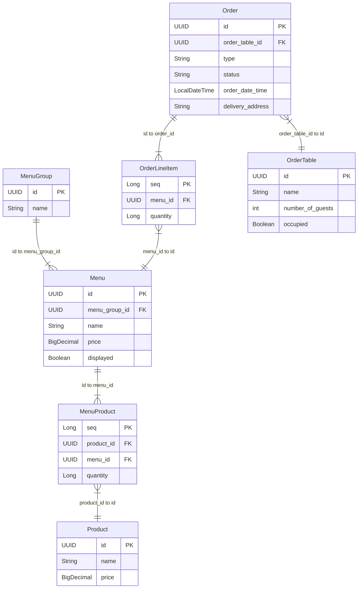

# 키친포스

## 퀵 스타트

```sh
cd docker
docker compose -p kitchenpos up -d
```

애플리케이션 실행 후(Run 버튼 클릭 or control + R) http 폴더에 있는 파일 실행하기(.http)


---

## 요구 사항

> 아래는 `mermaid` 로 표현한 ER Diagram 입니다.


```mermaid
erDiagram
    MenuGroup {
        UUID id PK
        String name
    }
    Menu {
        UUID id PK
        UUID menu_group_id FK
        String name
        BigDecimal price
        Boolean displayed
    }
    MenuProduct {
        Long seq PK
        UUID product_id FK
        UUID menu_id FK
        Long quantity
    }
    Product {
        UUID id PK
        String name
        BigDecimal price
    }
    Order {
        UUID id PK
        UUID order_table_id FK
        String type
        String status
        LocalDateTime order_date_time
        String delivery_address
    }
    OrderLineItem {
        Long seq PK
        UUID menu_id FK
        Long quantity
    }
    OrderTable {
        UUID id PK
        String name
        int number_of_guests
        Boolean occupied
    }

    MenuGroup ||--|{ Menu : "id to menu_group_id"
    Menu ||--|{ MenuProduct : "id to menu_id"
    MenuProduct }|--|| Product : "product_id to id"
    Order ||--|{ OrderLineItem : "id to order_id"
    OrderLineItem }|--|| Menu : "menu_id to id"
    Order }|--|| OrderTable : "order_table_id to id"
```

### 메뉴(Menu)

- **메뉴를 등록했다.**
    - [ ] 메뉴 가격 검증
        - 메뉴에 있는 가격이 있어야 한다. 만약 가격이 없거나 0원보다 작으면 예외가 발생한다.
    - [ ] 메뉴 그룹 검증
        - 메뉴 그룹이 존재해야 한다. 만약 메뉴 그룹이 존재하지 않으면 예외가 발생한다.
    - [ ] 메뉴 상품 존재 여부
        - 메뉴에 있는 상품이 존재해야 한다. 만약 상품이 없거나 비어 있으면 예외가 발생한다.
    - [ ] 상품 수와 실제 상품 개수 비교
        - 메뉴에 등록된 상품이 실제 상품의 갯수와 동일해야 한다. 만약 그렇지 않으면 예외가 발생한다.
    - [ ] 상품 수량 검증
        - 메뉴에 등록된 상품의 수량이 0개 이상이어야 한다. 만약 상품의 수량이 0보다 작으면 예외가 발생한다.
    - [ ] 상품 총 가격 검증
        - 메뉴에 포함된 상품들의 총 가격(sum, 상품 가격 * 수량)은 메뉴 가격과 비교하여 **작지 않아야** 한다. 만약 메뉴 가격이 상품들의 총 가격보다 적으면 예외가 발생한다.
    - [ ] 메뉴 이름 검증
        - 메뉴 이름이 없거나 부적절한 단어가 포함하면 예외가 발생한다.
    - [ ] 메뉴를 생성할 때 메뉴ID는 UUID 랜덤 값으로 생성된다.

- **메뉴에 있는 가격을 변경했다.**
    - [ ] 메뉴 가격 검증 - 메뉴 가격 변경 시 가격이 0 이상이어야 한다. 가격이 없거나 0 미만이면 예외가 발생한다.
    - [ ] 상품 총 가격 검증 - 메뉴에 포함된 상품들의 총 가격(sum, 상품 가격 * 수량)은 메뉴 가격과 비교하여 작지 않아야 한다. 메뉴 가격이 상품들의 총 가격보다 적으면 예외가 발생한다.

- **메뉴의 표시 상태를 변경했다.**
    - [ ] 메뉴가 존재해야 한다. 만약 메뉴가 존재하지 않으면 예외가 발생한다.
    - [ ] 메뉴에 포함된 상품들의 총 가격(sum, 상품 가격 * 수량)은 메뉴 가격과 비교하여 **작지 않아야** 한다. 메뉴 가격이 상품들의 총 가격보다 적으면 예외가 발생한다.
    - [ ] 메뉴의 `displayed` 상태를 `true`로 변경하여 메뉴를 표시 상태로 설정한다.

- **메뉴를 숨겼다.**
    - [ ] 메뉴가 존재해야 한다. 만약 메뉴가 존재하지 않으면 예외가 발생한다.
    - [ ] 메뉴의 `displayed` 상태를 `false`로 변경하여 메뉴를 숨긴다.

- **메뉴를 조회했다.**

### 메뉴 그룹(Menu Group)

- **메뉴 그룹을 생성했다.**
    - [ ] 메뉴 그룹명이 존재해야 한다. 만약 메뉴 그룹명이 없거나 빈 값이면 예외가 발생한다.
    - [ ] 메뉴 그룹을 생성할 때 메뉴 그룹ID는 UUID 랜덤 값으로 생성된다.

- **메뉴 그룹을 조회했다.**
    - [ ] 등록된 메뉴 그룹을 모두 조회할 수 있다.

### 상품

- **상품을 등록했다.**
    - [ ] 상품의 가격이 존재해야 하며 0보다 커야 한다. 만약 그렇지 않으면 예외가 발생한다.
    - [ ] 상품의 이름이 없거나 부적절한 단어가 포함되면 예외가 발생한다.
    - [ ] 상품을 생성할 때 상품ID는 UUID 랜덤 값으로 생성된다.

- **상품의 가격을 변경했다.**
    - [ ] 상품의 가격이 존재해야 하며 0보다 커야 한다. 만약 그렇지 않으면 예외가 발생한다.
    - [ ] 상품에 대한 ID가 존재해야 한다.
    - [ ] 메뉴에 포함된 상품들의 총 가격(sum, 상품 가격 * 수량)은 메뉴 가격과 비교하여 **작지 않아야** 한다.

- **상품을 조회했다.**
    - [ ] 등록된 상품을 모두 조회할 수 있다.

### 주문

> 주문 상태는 `배달`(DELIVERY), `테이크아웃`(TAKEOUT), `매장 내 식사`(EAT_IN) 가 있다.
>
> 주문 유형은 `대기`(WAITING), `승인됨`(ACCEPTED), `서빙됨`(SERVED), `배달중`(DELIVERING), `배달됨`(DELIVERED), `완료`(COMPLETED) 가 있다.


- **주문을 등록했다.**
    - [ ] 주문 유형이 존재해야 한다.
    - [ ] 주문 항목이 존재해야 한다.
    - [ ] 주문 유형이 `배달` 혹은 `테이크아웃`시 주문 수량이 0보다 커야 한다.
    - [ ] 주문 항목과 연관된 메뉴가 존재해야 한다.
    - [ ] 주문항목에 있는 가격이 메뉴에 있는 가격과 동일해야 한다.
    - [ ] 주문 유형이 `배달`이면 배달에 필요한 주소가 존재해야 한다.
    - [ ] 주문 유형이 `매장 내 식사`이면 가게 안에 자리가 꽉 차지 않아야 한다.

- **주문을 승인했다.**
    - [ ] 주문이 존재해야 한다.
    - [ ] 주문 상태가 `대기` 이어야 한다.
    - [ ] 주문 상태가 `배달` 이면 배달 라이더에게 주문에 대한 정보(주문 총 가격, 배달 주소)를 제공해줘야 한다.

- **주문을 서빙했다.**
    - [ ] 주문이 존재해야 한다.
    - [ ] 주문 상태가 `승인됨` 이어야 한다.
    - [ ] 주문 상태를 `서빙됨` 으로 변경한다.

- **배달을 시작했다.**
    - [ ] 주문이 존재해야 한다.
    - [ ] 주문 유형이 `배달` 이고 주문 상태가 `서빙됨` 이어야 한다.
    - [ ] 주문 상태를 `배달중` 으로 변경한다.

- **배달을 완료했다.**
    - [ ] 주문이 존재해야 한다.
    - [ ] 주문 상태가 `배달중` 이어야 한다.
    - [ ] 주문 상태를 `배달됨` 로 변경한다.


- **주문을 완료했다.**
    - [ ] 주문이 존재해야 한다.
    - [ ] 주문 유형이 `배달` 이면 주문 상태가 `배달됨` 여야 한다.
    - [ ] 주문 유형이 `테이크아웃` 또는 `매장 내 식사` 이면 주문 상태가 `서빙됨`이어야 한다.
    - [ ] 주문 유형이 `매장 내 식사` 이고 식사를 완료했다면 해당 테이블에 대한 자리가 비어있다고 변경한다.

- **주문을 전체 조회했다.**
    - [ ] 등록된 주문을 모두 조회할 수 있다.

### 주문 테이블

> 주문 테이블에 대한 상태는 true 또는 false 로 false 는 `사용 가능` 상태이고, true 는 `사용중` 상태를 의미한다.

- **주문 테이블을 생성했다.**
    - [ ] 주문 테이블의 이름이 존재해야 하며 비어있지 않아야 한다.
    - [ ] 주문 테이블의 기본 상태는 손님 수가 0명이고 테이블은 `사용 가능` 상태여야 한다.

- **주문 테이블에 손님이 앉았다.**
    - [ ] 주문 테이블이 존재해야 한다.
    - [ ] 주문 테이블의 상태를 `사용중` 으로 변경한다.

- **주문 테이블을 정리했다.**
    - [ ] 주문 테이블이 존재해야 한다.
    - [ ] 주문 상태가 `완료` 인 경우 해당 손님 수를 `0`으로 설정하고, 테이블을 `사용 가능` 상태로 변경한다.

- **주문 테이블에 있는 손님 수를 변경했다.**
    - [ ] 손님 수가 `0`명 이상이어야 한다.
    - [ ] 주문 테이블이 존재해야 한다.
    - [ ] 주문 테이블이 현재 `사용중` 이어야 한다.
    - [ ] 위의 조건을 모두 만족하면 해당 손님 수를 변경한다.

- **주문 테이블을 전체 조회했다.**
    - [ ] 등록된 주문 테이블을 모두 조회할 수 있다.


---

## 용어 사전

| 한글명 | 영문명 | 설명 |
| --- | --- | --- |
|  |  |  |


---

## 모델링
