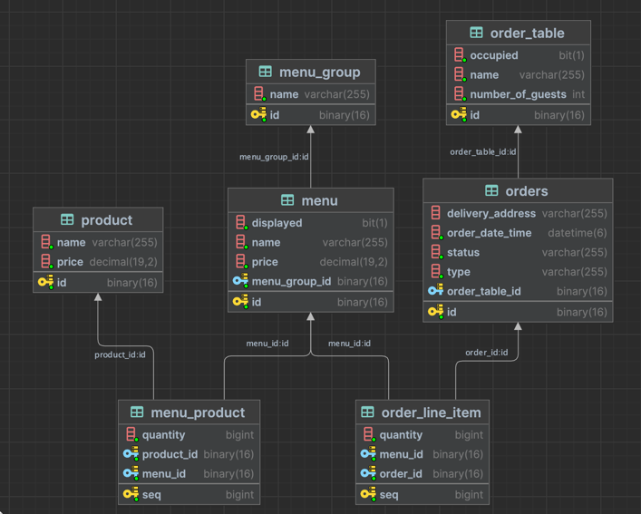

## 참조1- API 엔드포인트
- menu-group
    - GET [/api/menu-groups] `MenuGroupRestController#findAll`
    - POST [/api/menu-groups]    `MenuGroupRestController#create`
    -
- menu
    - GET [/api/menus]    `MenuRestController#findAll`
    - POST [/api/menus]    `MenuRestController#create`
    - PUT [/api/menus/menuId/display]    `MenuRestController#display`
    - PUT [/api/menus/menuId/hide]    `MenuRestController#hide`
    - PUT [/api/menus/menuId/price]    `MenuRestController#changePrice`
    -
- order-tables
    - GET [/api/order-tables]    `OrderTableRestController#findAll`
    - POST [/api/order-tables]    `OrderTableRestController#create`
    - PUT [/api/order-tables/orderTableId/clear]    `OrderTableRestController#clear `
    - PUT [/api/order-tables/orderTableId/number-of-guests]    `OrderTableRestController#changeNumberOfGuests`
    - PUT [/api/order-tables/orderTableId/sit]    `OrderTableRestController#sit`
    -
- orders
    - GET [/api/orders]    `OrderRestController#findAll`
    - POST [/api/orders]    `OrderRestController#create`
    - PUT [/api/orders/orderId/accept]    `OrderRestController#accept`
    - PUT [/api/orders/orderId/complete]    `OrderRestController#complete`
    - PUT [/api/orders/orderId/complete-delivery]    `OrderRestController#completeDelivery`
    - PUT [/api/orders/orderId/serve]    `OrderRestController#serve`
    - PUT [/api/orders/orderId/start-delivery]    `OrderRestController#startDelivery`
    -
- products
    - GET [/api/products]    `ProductRestController#findAll`
    - POST [/api/products]    `ProductRestController#create`
    - PUT [/api/products/productId/price]    `ProductRestController#changePrice`
-

## 참조2 - DB 스키마

